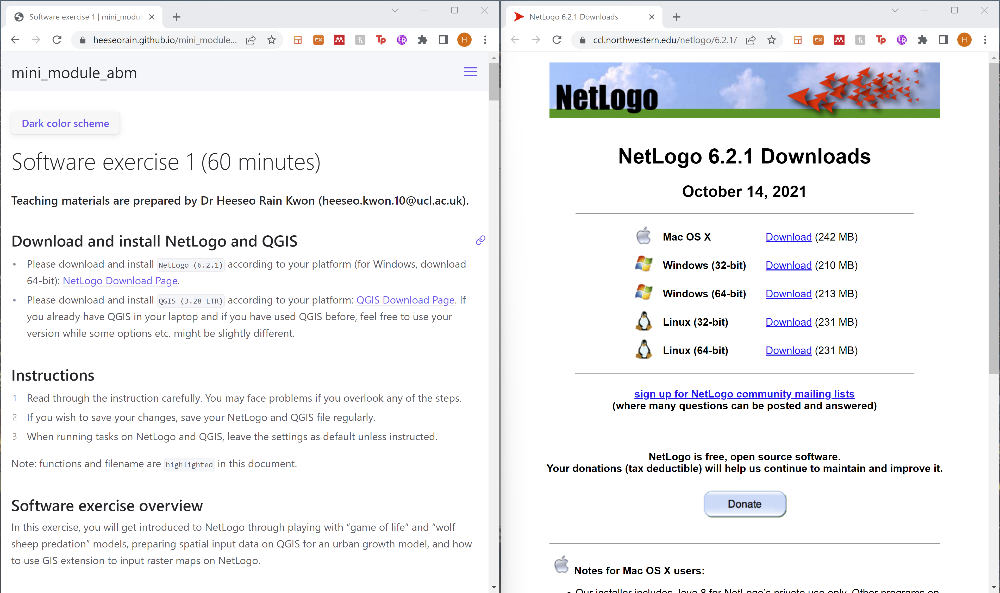

<button class="btn js-toggle-dark-mode">Dark color scheme</button>

<script type="text/javascript" src="{{ "/assets/js/dark-mode-preview.js" | absolute_url }}"></script>

# Software exercise 1-1: Introducing NetLogo (30 minutes)
### Teaching materials are prepared by Dr Heeseo Rain Kwon (heeseo.kwon.10@ucl.ac.uk). 

Note: Recommend having this teaching material on one side of the screen and your activity on the other side.



## Download and install NetLogo
- Please download and install `NetLogo (6.2.1)` according to your platform (for Windows, download 64-bit): [NetLogo Download Page](https://ccl.northwestern.edu/netlogo/6.2.1/){:target="_blank"}.

## Example 1: Game of Life and understanding NetLogo codes (10min)
- Go through at your own pace.

1. Open `NetLogo 6.2.1` (NOT `NetLogo 3D 6.2.1`). The interface will be explained along with exercises. Note: You can refer to [NetLogo User Manual (6.2.1)](https://ccl.northwestern.edu/netlogo/6.2.1/docs/){:target="_blank"} for more information.
2. In `File` > `Models Library`, you can find a collection of sample models to explore. Note: You can find more on the [NetLogo User Community Models web page](http://ccl.northwestern.edu/netlogo/models/community/index.cgi){:target="_blank"} in your own time.

3. `File` > `Models Library` > `Computer Science` > `Cellular Automata` > `Life`.


- Game of Life is a simple cellular automata (CA) model where the state of the grid cells (patches in NetLogo terminology) changes according to behavioral rules. 
- As the simulation runs, you can find recurring shapes like gliders and blinkers. 
- Note: You can quickly scroll through [Conway's Game of Life](https://en.wikipedia.org/wiki/Conway%27s_Game_of_Life){:target="_blank"} to get a quick idea. Another good read in your own time is [The Lasting Lessons of John Conway's Game of Life](https://www.nytimes.com/2020/12/28/science/math-conway-game-of-life.html){:target="_blank"}.

4. Click `setup-random` > `go-forever` to start the simulation, and click `go-forever` again to stop the simulation.


5. Let's check the `Code` tab. 
- Note: If you don't see line numbers, for Windows users, on the `Menu bar`, click `Tools` > `Preferences` and check `Show Line Numbers`. 
- For Mac users, on the `Menu bar`, click `NetLogo` > `Preferences` and check `Show Line Numbers`. 


6. In line 5-7, `living?` and `live-neighbors` are the properties/attributes that patches own. 
- Go back to the `Interface` tab and try right-clicking on one of the patches. You can right click on a random grid cell (patch) and see the patch properties.


- Back to the 'Code' tab, in line 12, `ask patches [ cell-death ]` means to [ask](http://ccl.northwestern.edu/netlogo/docs/dict/ask.html){:target="_blank"} patches to run the `[ cell-death ]` command. 
- In line 30, `[ cell-death ]` command sets the patch property `living?` as false, and sets patch color as foreground color. `[ cell-birth ]` command does the opposite.


7. Line 16-23 dictates the `setup-random` command.
- Line 18 means "ask patches to run the [ifelse](http://ccl.northwestern.edu/netlogo/docs/dict/ifelse.html){:target="_blank"} command. ifelse commands are very important in language-based rules. 
- Line 19-21 means "if `random-float 100 < initial-density` reports true (in other words, "if a `random floating point number >= 0 but less than 100` is less than the `initial density (default = 35.0%)`"), run the `[ cell-birth ]` command, and otherwise, run the `[ cell-death ]` command. 
- This part makes each cell to check the state of itself.
- Note: You can refer to [NetLogo Dictionary](http://ccl.northwestern.edu/netlogo/docs/index2.html){:target="_blank"} when trying to understand the codes. For example, [random-float](http://ccl.northwestern.edu/netlogo/docs/dict/random-float.html){:target="_blank"}.


8. Line 35-48 dictates the `go` command.
- Line 36-37 means "set the patch property `live-neighbors` to `the number of neighboring cells that are alive`". 
- This makes each cell to check the state of its eight surrounding neighbors. Note: Refer to [neighbors](http://ccl.northwestern.edu/netlogo/docs/dict/neighbors.html){:target="_blank"}.
- Line 42-46 asks patches to run another ifelse command. Let's look into this with the questions below.

### Example 1: Questions (10min):
- Please write all your answers in a notepad (paper or laptop). We will go through the answers together.
- Go through at your own pace. If you don't manage to go through all Qs, you can resume in the final session (5pm). If you finish quickly, feel free to start [[Exercise 4]](./exercise4.md){:target="_blank"}.

Q1. Click the `Info` tab below the `Menu bar`. Under `HOW IT WORKS`, you can find the rules of the game. 


Rules can be summarised as the four points below. 
1. If there is exactly 3 alive neighbors, the cell becomes alive. (birth)
2. If there are less than 2 alive neighbors, the cell dies. (under-population)
3. If there are more than 3 alive neighbors, the cell dies. (over-population)
4. If there are 2 alive neighbors, the cell remains in the state it is in. (sustainable life)

Q1-1. Try writing these rules into NetLogo code using [if](http://ccl.northwestern.edu/netlogo/docs/dict/if.html){:target="_blank"} statement: `if boolean [ commands ]`.
- Use the patch property `live-neighbors` and the commands `cell-birth` and `cell-death`.
- One line of code for the first three points. (You don't need to worry about the 4th point because it doesn't change the cell state.)

Q1.2. Explain how these three lines of code can be shorted to line 43-46 written in the model using the [ifelse](http://ccl.northwestern.edu/netlogo/docs/dict/ifelse.html){:target="_blank"}.


Q2. In line 33, try changing `neighbors` to `neighbors4` and run the model. Observe and explain how this change affects the simulation. (Refer to [neighbors4](http://ccl.northwestern.edu/netlogo/docs/dict/neighbors.html).)

Q3. Let's add one additional command to the model. Add the following lines below the `to cell-death` part. This command makes this cell colored in green to kill the four surrounding patches.  Explain this rule in your own words. 
- Note: In case you don't see green zombie cells appearing, you change the `neighbors4` back to `neighbors` as in the screenshot below and set the initial-density around 35% so that cells don't die out too quickly. Also, try pressing "go-once" several times rather than "go-forever".
```
to zombie-birth
  set living? true
  ask neighbors [ cell-death ]
  set pcolor green
end
```


Q4. Let's add a new rule for `zombie-birth`. Add the following lines below the `ask patches [ ifelse ]` part. This rule runs the same ifelse command on the 1,000 randomly chosen patches, this time for `zombie-birth`.
- Note: [n-of](http://ccl.northwestern.edu/netlogo/docs/dict/n-of.html). Run the model and explain how this change affects the simulation.
```
ask n-of 1000 patches
  [ ifelse live-neighbors = 3
    [ zombie-birth ]
    [if live-neighbors != 2
      [ cell-death ] ] ]
```         


### Example 2: Wolf Sheep Predation and understanding parameters, turtles and patches (5min)
1. `File` > `Models Library` > `Biology` > `Wolf Sheep Predation`.


### Example 2: Questions (10min): 
- We will go through these together.

Q1. Click `setup` > `go` to start the simulation, and click `go` again to stop the simulation.
- With these initial parameter settings, what happens?
- Try running the model a few times. Do you get the same results or different? Why do you think so?

Q2. Try running the model with following changes:
- Decrease `initial-number-wolves` to 20. What happens? How does the plot help you explain what happened?
- Set `initial-number-sheep` to 80 and `initial-number-wolf` to 50. Set `sheep-reproduce` to 10.0%. Run the simulation. What happens?

Q3. Currently, one more important agent of the ecosystem is missing - grass.
- Change the `model-version` to `sheep-wolves-grass`. Sheep and wolves are the moving agents (turtles in NetLogo), and grass form a grid of stationary agents (patches).
- How does including grass in the model affect the sheep and wolf population?

## Introducing QGIS and using it with NetLogo (30min)

### QGIS project setup
1. Create a folder at your preferred directory on your disk (e.g. "abm" in Desktop). This folder will be the working directory for all the files.
2. Open QGIS 3.28.4.
3. Click `Project` > `New`.
4. Click `Project` > `Save As`, and save as `newforest.qgz` to the working directory. 

