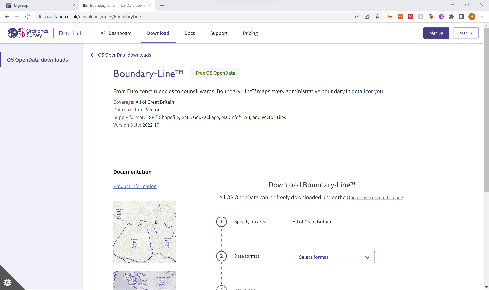
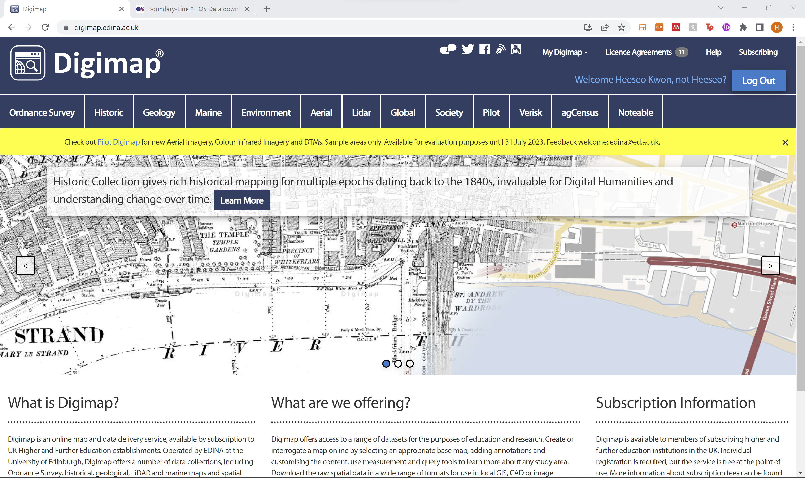
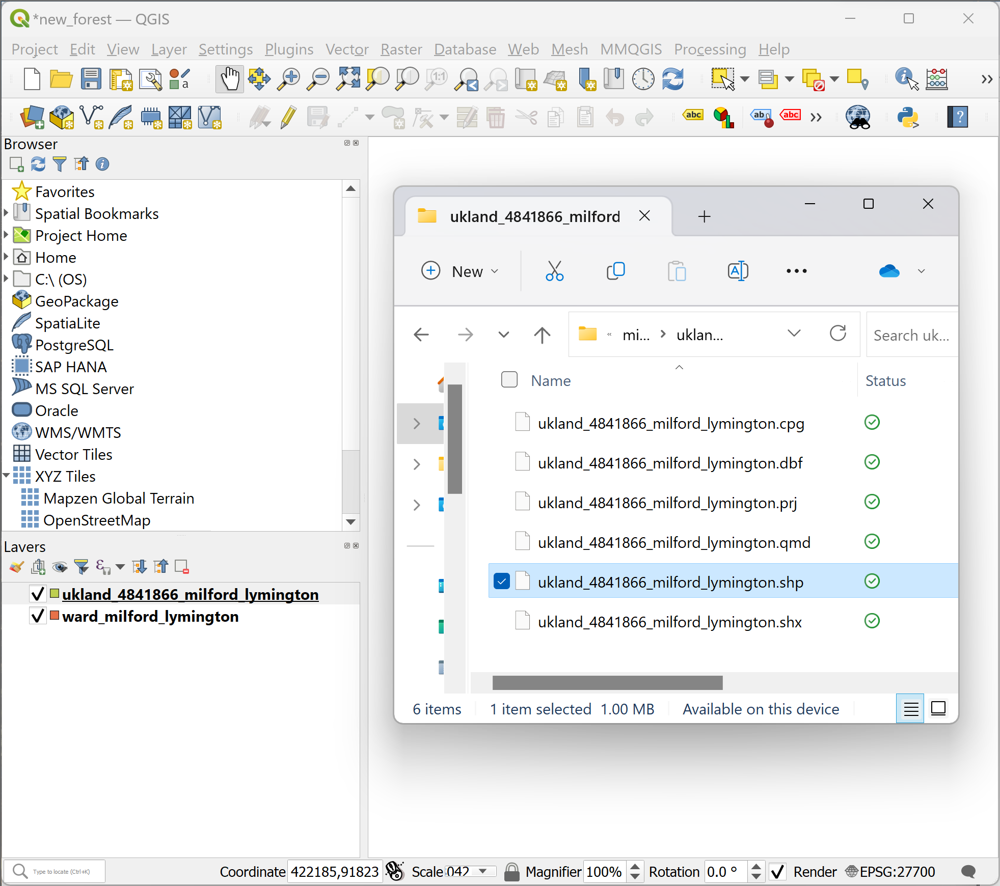
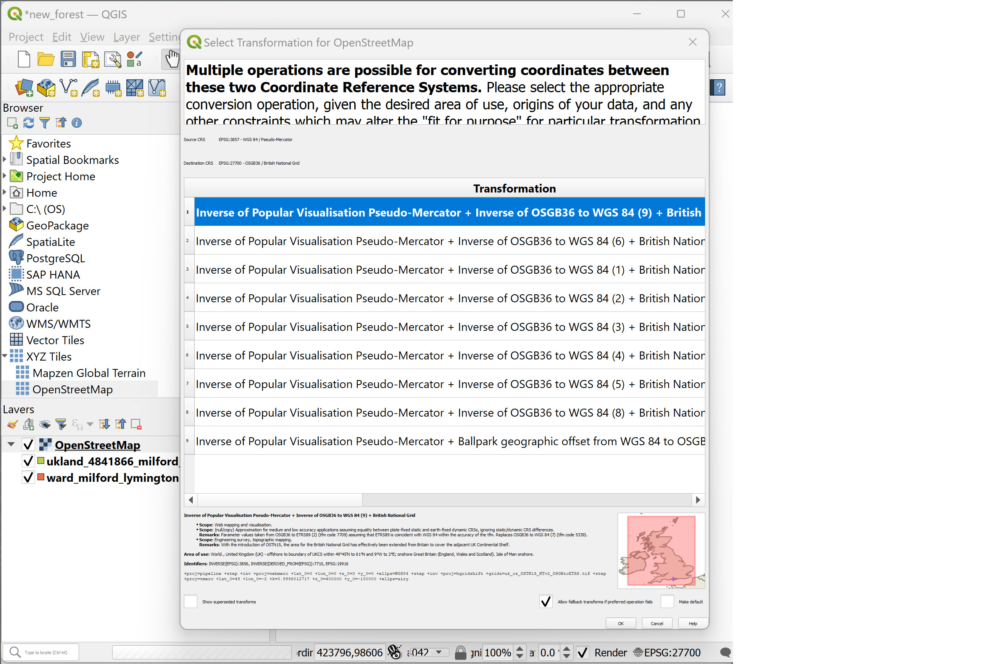
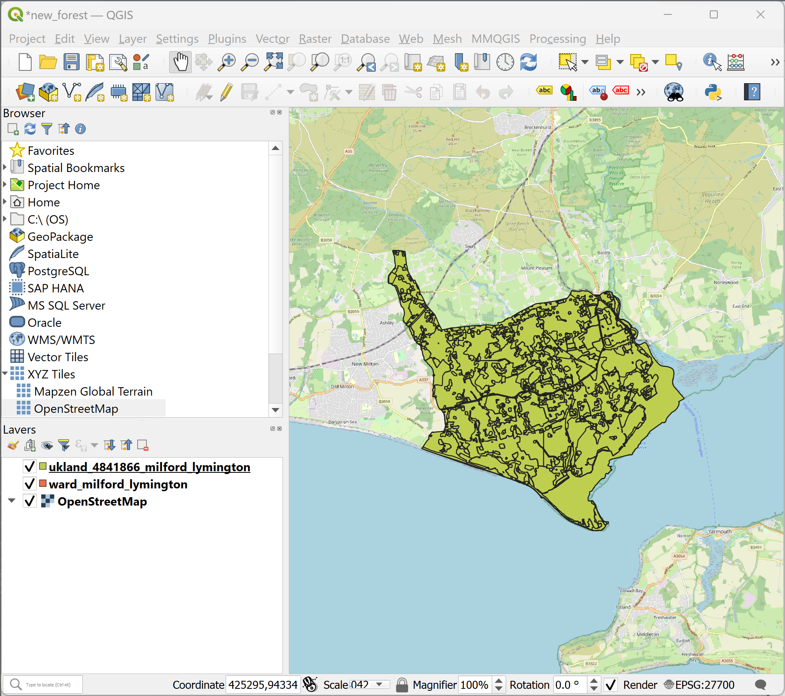
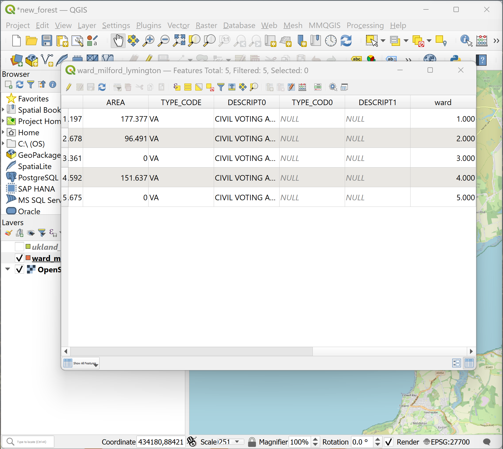
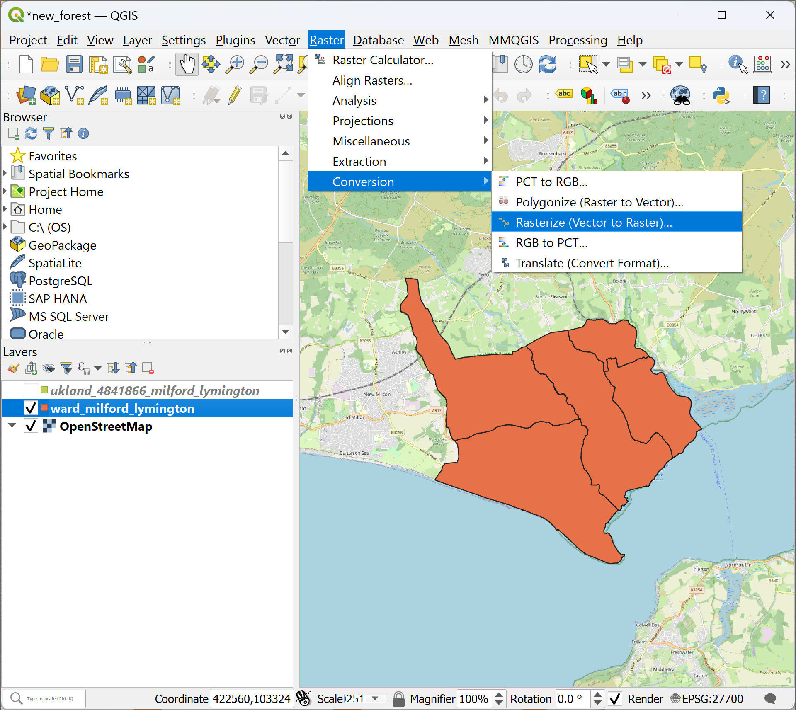
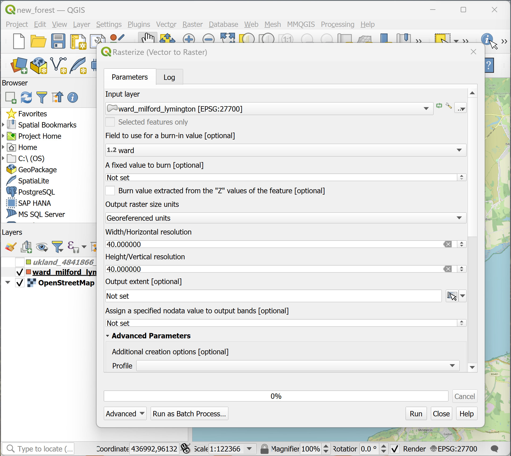
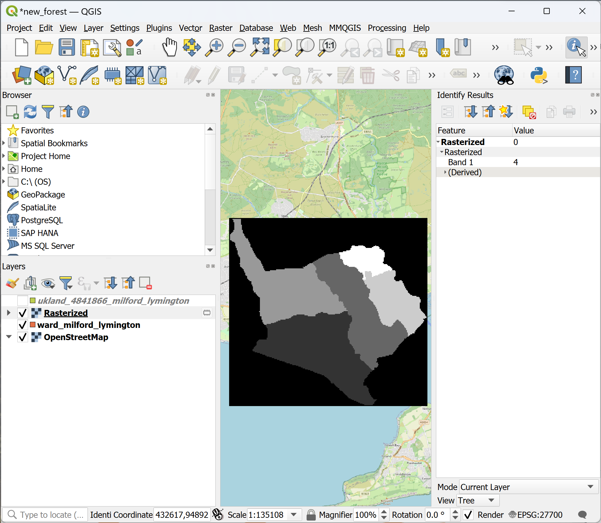

# Software exercise 1-2: Using QGIS with NetLogo (30 minutes)
### Teaching materials are prepared by Dr Heeseo Rain Kwon (heeseo.kwon.10@ucl.ac.uk). 

## Download and install QGIS
- Please download and install `QGIS 3.28 LTR` according to your platform: [QGIS Download Page](https://www.qgis.org/en/site/forusers/download.html#){:target="_blank"}.

### Example 1: Preparing spatial input data on QGIS for an urban growth model
- As an example of an urban growth model, we will use [Isobenefit Urbanism morphogenesis](https://www.sciencedirect.com/science/article/pii/S0301479719307571){:target="_blank"} currently being reimplemented by Dr Heeseo Rain Kwon (2023) as part of a project led by Dr Tommaso Gabrieli at UCL. 
- We will use data of a small part of [New Forest District](https://www.google.com/maps/place/New+Forest+District/){:target="_blank"} which includes Milford on Sea and Lymington.

1. Download boundary map of the case area: [ward_milford_lymington.zip](https://github.com/heeseorain/mini_module_abm/blob/master/data/ward_milford_lymington.zip){:target="_blank"} and save it in your working directory (e.g. your "mini_module_abm" folder). Extract the zip file.
- Note: This boundary map is extracted from the [Ordinance Survey Data Hub](https://osdatahub.os.uk/downloads/open/BoundaryLine). If you're interested in accessing spatial data for different parts of UK, OS Data Hub is a good source.

   

2. Download land use map of the case area: [ukland_4841866_milford_lymington.zip](https://github.com/heeseorain/mini_module_abm/blob/master/data/ukland_4841866_milford_lymington.zip){:target="_blank"} and save it in your working directory (e.g. your "mini_module_abm" folder). Extract the zip file.
- Note: This land use map is extracted from the "UKLand" data of [Verisk Data Download](https://digimap.edina.ac.uk/roam/download/verisk){:target="_blank"}. [Edina Digimap](https://digimap.edina.ac.uk/) is a great source for spatial data - if you're interested, log in with your UCL account and try exploring what's available. 

   

3. Open QGIS 3.28.4. On the menu bar, Click `Project` > `Save` (or `Save as`, it doesn't matter) and save the project as "new_forest.qgz".

4. Drag and drop `ward_milford_lymington.shp` and `ukland_4841866_milford_lymington.shp` into the `Layers` box. 
- Alternatively, you can click on the menu tab, `Layer` > `Add Layer` > `Add Vector Layer`.
- These shapefiles are vector data, i.e. made of points, lines, and polygons. 

   

5. In the `Browser` box, Click `XYZ Tiles` > `OpenStreetMap` > the first option > `OK`. Drag the 'OpenStreetMap' layer to the very bottom.
- The Transformation option 1 is likely to come up as 'Inverse of Popular Visualisation Pseudo-Mercator + Inverse of OSGB36 to WGS 84 (9) + British National Grid'. If not, please ask for help.
- This places OpenStreetMap beneath our spatial data to aid our understanding of the case area.

   
   

6. It is useful to convert vector data into raster data (i.e. made of pixels or grid cells) and load on NetLogo. 
- The grid cells of the raster data can correspond to the patches in NetLogo. Hence, We can assign the patch property based on the raster data.

7. Let's make a raster map of the wards in the case area in 40*40m grid cells.
- In the `Layers` box, right-click on `ward_milford_lymington` and click `Open Attributes Table`.
- 

   

   

   

   
