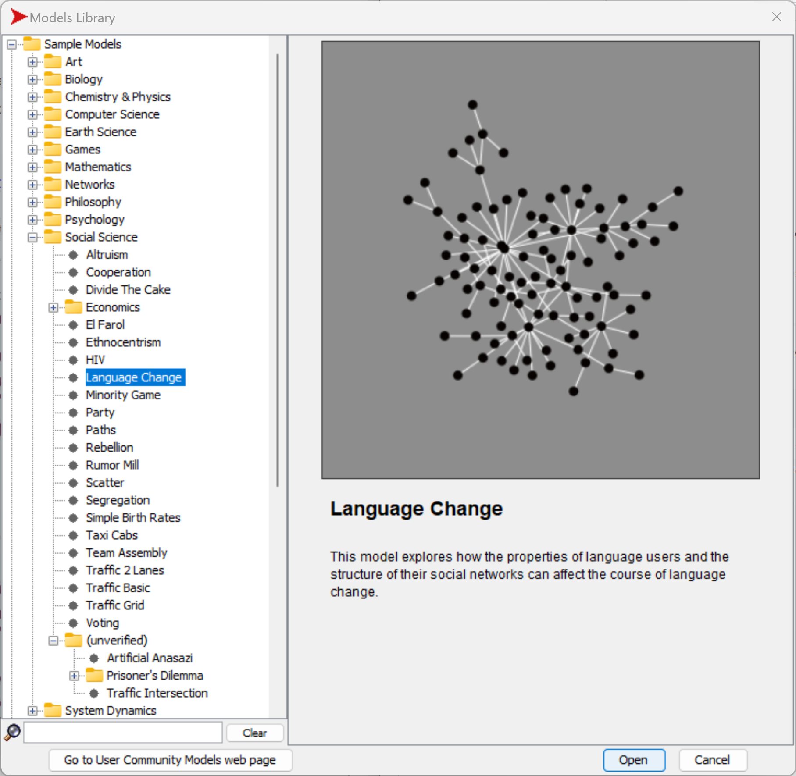
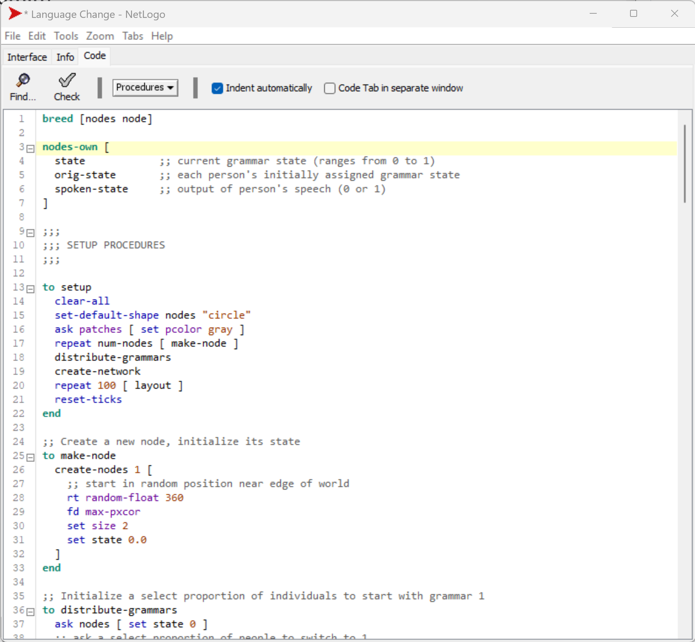
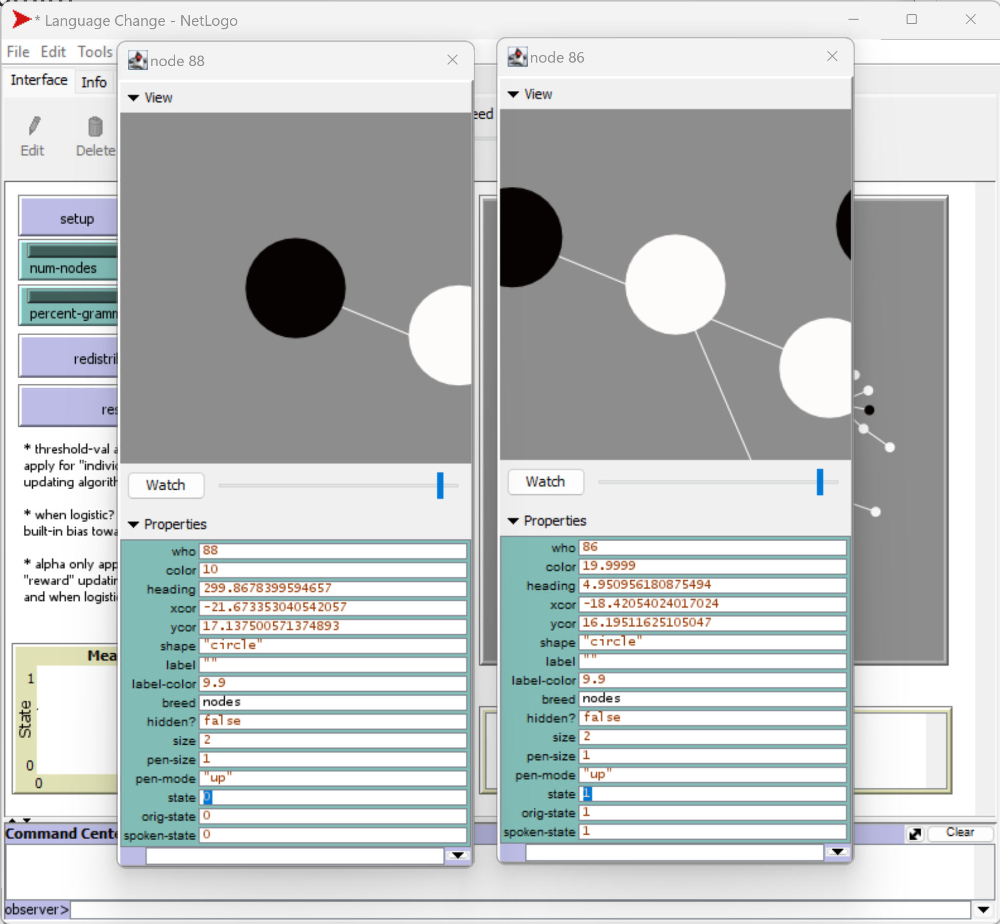
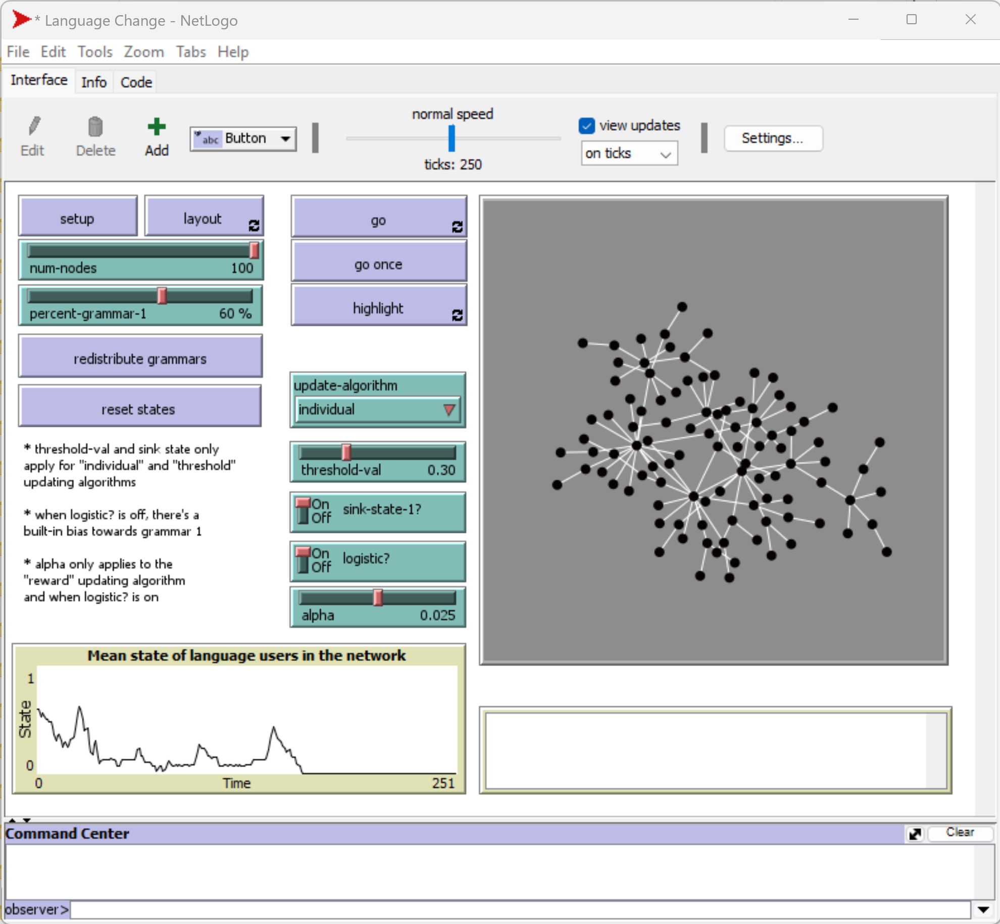
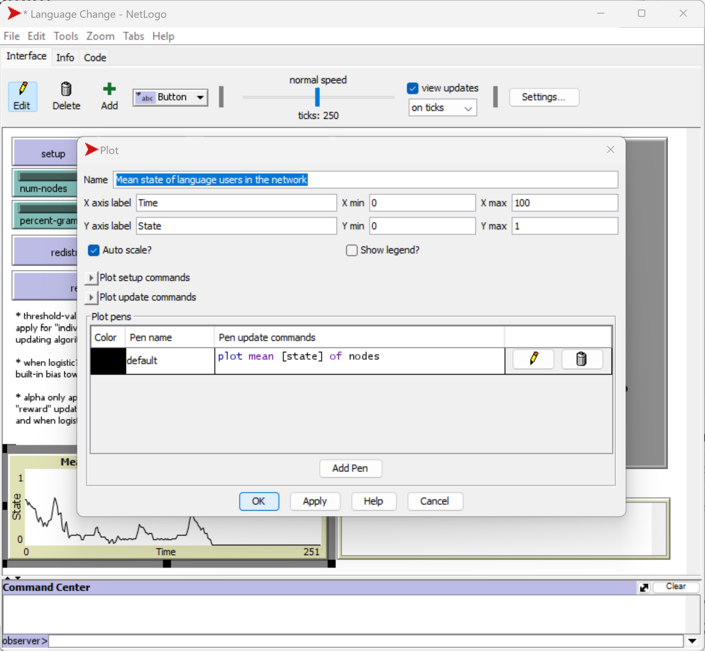
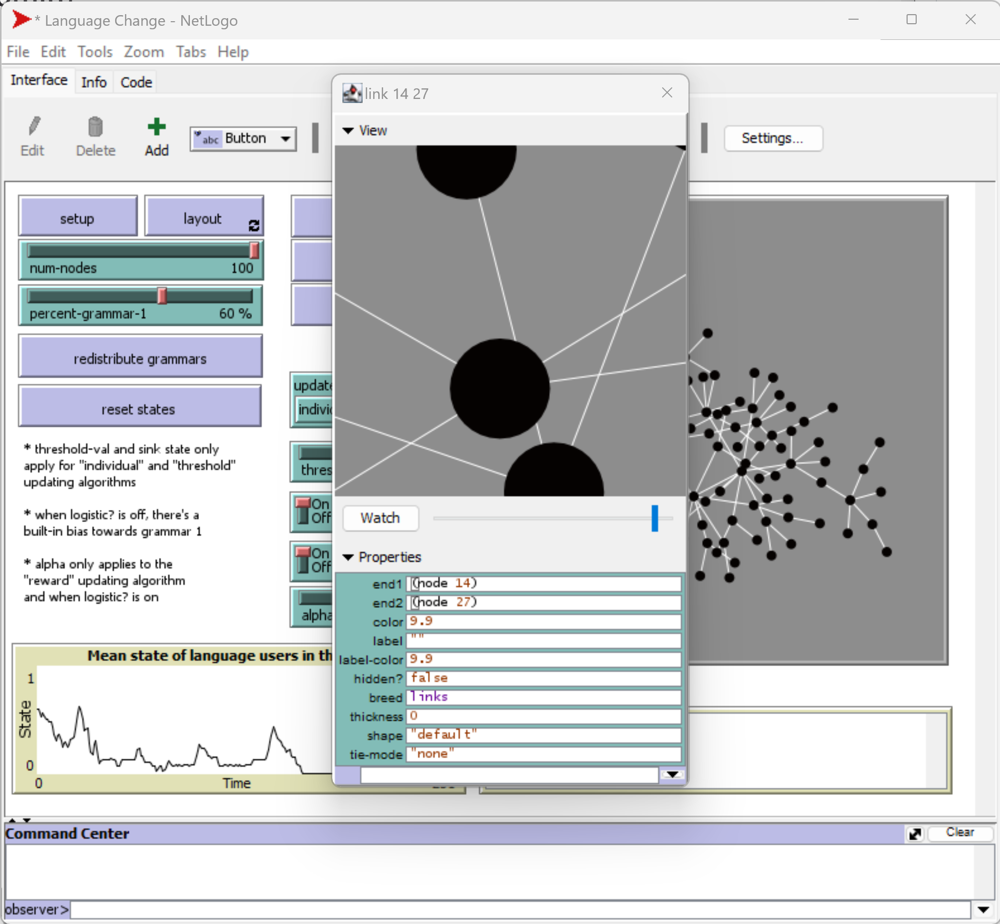
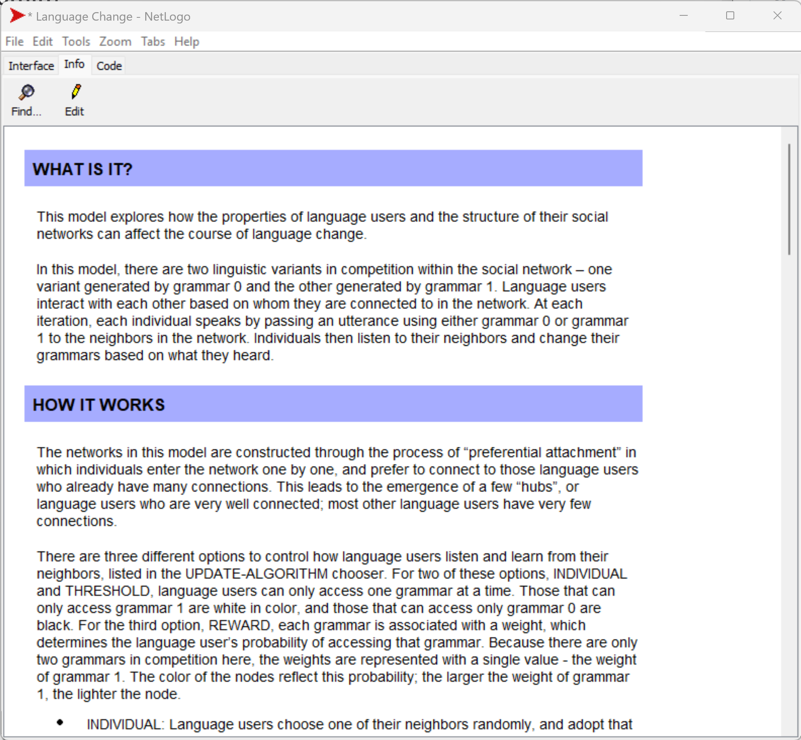

<button class="btn js-toggle-dark-mode">Dark color scheme</button>

# Software exercise 2 - Introducing NetLogo: language change model and contact tracing (15 minutes)
### Teaching materials are prepared by Dr Heeseo Rain Kwon (heeseo.kwon.10@ucl.ac.uk).

## Example 1: Language change model (10min)
- Go through at your own pace.

1. Open `NetLogo 6.2.1` (NOT `NetLogo 3D 6.2.1`). 
2. `File` > `Models Library` > `Social Science` > `Language Change`.
- Game of life model showed how `patches` are used in NetLogo.
- Wolf sheep predation model showed how `patches` and `turtles` are used in NetLogo.
- Language change model is a good example that shows how `turtles` and `links` are used in NetLogo.

   

3. Click `setup`.
- This model explores how the properties of language users (`turtles`) and the structure of their social networks (`links`) affect the change of the 'state' (measured as the linguistic variants 1 and 2) of a language.
- In wolf sheep predation model, there were two types of turtles (wolves and sheep) and one type of patch (grass).
- In language change model, there is one type of turtle (nodes) and one type of link (link as in social network). Here, patches don't play any role, they are just coloured in gray.

4. Click the `Code` tab.
- `nodes` are the breeds of turtles in this model. (For more information: [breed](https://ccl.northwestern.edu/netlogo/bind/primitive/breed.html){:target="_blank"}.
- These nodes own three properties: `state`, `orig-state` and `spoken-state`.
  - Right-click on the node > `node` > `inspect node` black and white nodes and check the property `state`. 
  - You will see that white nodes have state 0 and black nodes have state 1. 
  
   
   

5. With the original parameter setting, click `go`.
- What happens?
- Right-click anywhere on the plot and click `Edit`.
  - Do you see how you right command to plot an important metric in your model? (e.g. `plot mean [state] of nodes)

   
   

6. Right-click on a link and click `insepct link`.
- Each link connects two nodes.
- `Links` can be used very usefully in NetLogo. We will quickly cover this in Example 2.
- If you're interested in this language change model, feel free to read the `Info` tab in your own time and experiment more.

   
   
   
## Example 2: Contact tracing (5min)
- Go through at your own pace.

1. [create-links-with](https://ccl.northwestern.edu/netlogo/bind/primitive/create-links-with.html){:target="_blank"} [link-neighbors](https://ccl.northwestern.edu/netlogo/bind/primitive/link-neighbors.html){:target="_blank"} and [my-links](http://ccl.northwestern.edu/netlogo/docs/dict/my-links.html){:target="_blank"} can be used to simulate contact tracing.
- 

