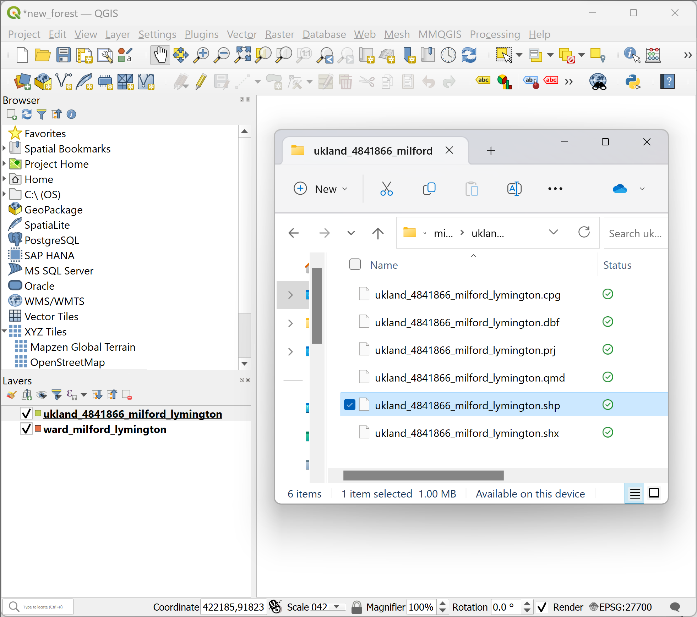
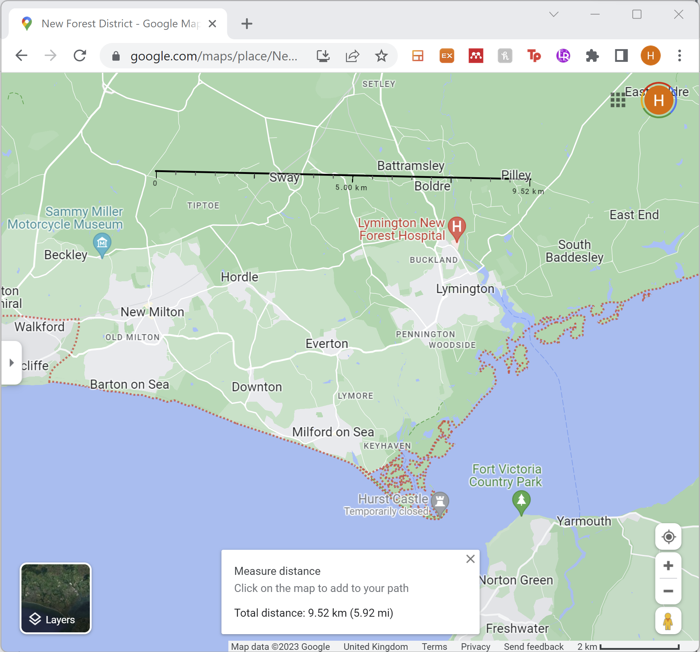
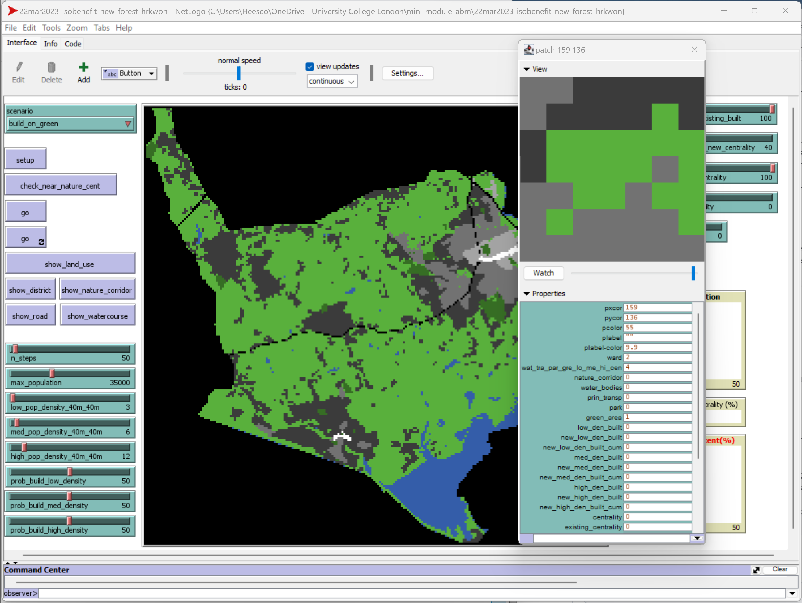

<button class="btn js-toggle-dark-mode">Dark color scheme</button>

# Software exercise 3: Using QGIS with NetLogo (40 minutes)
### Teaching materials are prepared by Dr Heeseo Rain Kwon (heeseo.kwon.10@ucl.ac.uk). 

## Download and install QGIS
- Please download and install `QGIS 3.28 LTR` according to your platform: [QGIS Download Page](https://www.qgis.org/en/site/forusers/download.html#){:target="_blank"}.

### Example 1: Preparing spatial input data on QGIS for an urban growth model (15min)
- Go through at your own pace.
- As an example of an urban growth model, we will use [Isobenefit Urbanism morphogenesis](https://www.sciencedirect.com/science/article/pii/S0301479719307571){:target="_blank"} currently being reimplemented by Dr Heeseo Rain Kwon (2023) as part of a project led by Dr Tommaso Gabrieli at UCL. (You would have received introduction to this model in the lecture right before this exercise).
- We will use data of a small part of [New Forest District](https://www.google.com/maps/place/New+Forest+District/){:target="_blank"} which includes Milford on Sea and Lymington.

1. Download boundary map of the case area: [ward_milford_lymington.zip](https://github.com/heeseorain/mini_module_abm/blob/master/data/ward_milford_lymington.zip){:target="_blank"} and save it in your working directory (e.g. your "mini_module_abm" folder). Extract the zip file.
- Note: This boundary map is extracted from the [Ordinance Survey Data Hub](https://osdatahub.os.uk/downloads/open/BoundaryLine). If you're interested in accessing spatial data for different parts of UK, OS Data Hub is a good source.

   

2. Download land use map of the case area: [ukland_4841866_milford_lymington.zip](https://github.com/heeseorain/mini_module_abm/blob/master/data/ukland_4841866_milford_lymington.zip){:target="_blank"} and save it in your working directory (e.g. your "mini_module_abm" folder). Extract the zip file.
- Note: This land use map is extracted from the "UKLand" data of [Verisk Data Download](https://digimap.edina.ac.uk/roam/download/verisk){:target="_blank"}. [Edina Digimap](https://digimap.edina.ac.uk/) is a great source for spatial data - if you're interested, log in with your UCL account and try exploring what's available. 

   

3. Open QGIS 3.28.4. On the menu bar, Click `Project` > `Save` (or `Save as`, it doesn't matter) and save the project as "new_forest.qgz".

4. Drag and drop `ward_milford_lymington.shp` and `ukland_4841866_milford_lymington.shp` into the `Layers` box. 
- Alternatively, you can click on the menu tab, `Layer` > `Add Layer` > `Add Vector Layer`.
- These shapefiles are vector data, i.e. made of points, lines, and polygons. 

   

5. In the `Browser` box, Click `XYZ Tiles` > `OpenStreetMap` > the first option > `OK`. Drag the 'OpenStreetMap' layer to the very bottom.
- The Transformation option 1 is likely to come up as 'Inverse of Popular Visualisation Pseudo-Mercator + Inverse of OSGB36 to WGS 84 (9) + British National Grid'. If not, please ask for help.
- This places OpenStreetMap beneath our spatial data to aid our understanding of the case area.

   
   

6. It is useful to convert vector data into raster data (i.e. made of pixels or grid cells) and load on NetLogo. 
- The grid cells of the raster data can correspond to the patches in NetLogo. Hence, We can assign the patch property based on the raster data.

7. Let's make a raster map of the wards in the case area in 40*40m grid cells.
- In the `Layers` box, right-click on `ward_milford_lymington` and click `Open Attributes Table`.
- There are five wards in our case area.

   
   
8. I have already created a field `ward` and assigned values 1 to 5 to each of the ward (1=Milford, 2=Pennington, 3=Hordle, 4=Lymington Town, 5=Buckland)
- Note: New field can be created by clicking the `Field calculator` icon (4th from the right in the Attribute Table menu bar). If you want to use this field to generate a raster file to be loaded on NetLogo, I suggest using `Decimal number (real)` as the `Output field type`.

9. Now, we will use this field 'ward` to generate a raster file. On the QGIS menu bar, click `Raster` > `Conversion` > `Rasterize (Vector to Raster)`.

   
   
10. In the `Parameters`, put the following, click `Run` and click `Close`.
- Input layer: `ward_milford_lymington`
- Field to use for a burn-in value: `ward`
- A fixed value to burn: Click the `X` button on the right to make it `Not set`.
- Output raster size units: `Georeferenced units`
- Width/Horizontal resolution: `40`
- Height/Vertical resolution: `40`
- Output extent: Leave it as `Not set`.
- Assign a specified nodata vlaue to output bands: Click the `X` button on the right to make it `Not set`.

   

11. A new file `Rasterized` is created. On the QGIS menu bar, click on the `Identify Features` icon (looks like an information sign) and click on the wards on the screen.
- You will see that the following values are assigned to the wards: 1=Milford, 2=Pennington, 3=Hordle, 4=Lymington Town, 5=Buckland.

   

12. Right-click on the `Rasterized` layer. 
- In the `Information` tab, you can check that the `Pizel Size` is 40, -40. 
- Also, it says `Dimensions`as `X: 232 Y:220`. This means there are 232 grid cells on the X-axis and 220 grid cells on the Y axis. What do you think the dimension is in metre?
- 232*40m * 220*40m = 9,280m * 8,800m. 

   
   
13. Let's check on the Google Maps [New Forest District](https://www.google.com/maps/place/New+Forest+District/){:target="_blank"}. 
- Zoom into our case area and right-click > `Measure distance` to roughly check whether our raster map makes sense. Sense-cheking like this is very useful and important.
- So then, what is the number of grid cells that we're dealing with as a simple XY measurement?
- 232 * 220 = 51,040 of 40*40m grid cells.

   

14. Let's make the raster map for land use in the same way. Let's first understand the land use shapefile.
- In the `Layers` box, right-click on `ukland_4841866_milford_lymington` and click `Attribute Table`.
- This shapefile is made of 939 features.
- The `landuse_te` field seem to contain useful information.

   
   
15. In the `Layers` box, right-click on `ukland_4841866_milford_lymington` and click `Properties`.
- In the `Symbology` tab, select `Categorized` and `landuse_te`.
- Click `Classify` and `OK`.

   

16. In the `Layers` box, Click the arrow on the left of `ukland_4841866_milford_lymington`. You will see the land use information colour-coded.
- FYI: You can of course change the colour, join a few land use categories together etc.

17. We want to turn this land use map into a raster file.
- Right-lick on `ukland_4841866_milford_lymington` > `Attribute Table`.
- I've already createde a field `wat_tra_pa` and assigned values from 1 to 8 to represent the land use classification most useful for my Isobenefit Urbanism model.
  - 1=water bodies
  - 2=principle transport (main road/rail)
  - 3=park (recreational land)
  - 4=green (including uses that could be built on e.g., farms, industrial areas)
  - 5=low-density residential with amenities (suburbs and small villages / hamlets)
  - 6=medium-density residential with high streets and amenities (including medium-density buildings of various use and retail parks)
  - 7=high-density residential with retail and commercial sites
  - 8=centrality (i.e., town/city centre)

   

18. Same as before, we will use the field `wat_tra_pa` to rasterize this vector data. On the QGIS menu bar, click `Raster` > `Conversion` > `Rasterize (Vector to Raster)`.
   
19. In the `Parameters`, put the following, click `Run` and click `Close`.
- Input layer: `ukland_4841866_milford_lymington`
- Field to use for a burn-in value: `wat_tra_pa`
- A fixed value to burn: Click the `X` button on the right to make it `Not set`.
- Output raster size units: `Georeferenced units`
- Width/Horizontal resolution: `40`
- Height/Vertical resolution: `40`
- Output extent: Leave it as `Not set`.
- Assign a specified nodata vlaue to output bands: Click the `X` button on the right to make it `Not set`.

   

20. Same as before, try clicking the `Identify Features` icon on the QGIS menu bar and to check whether the number values are assigned accurately on the raster map.

21. These `Rasterized` files are temporary files on QGIS at the moment so we need to save them.
- In the `Layers` box, right-click the raster layer generated from `ward_milford_lymington` > `Export` > `Save As`.
- Name the file `ward_40m.tif` and save it in your working directory.

   

22. Repeating the same procedure, right-click the raster layer generated from `ukland_4841866_milford_lymington` > `Export` > `Save As`.
- Name the file `wat_tra_par_gre_lo_me_hi_cen_40m.tif` and save it in your working directory.
- Note: I've already cookie-cutted the land use vector file to the same extent as the boundary vector file so they rasterize with the same extent. If you want to  prepare raster files from vector files for your own use using different data, remember that having the extent identical for the raster files is important for the the grid cells to align when loaded on NetLogo.
- Remove the `Rasterized` layers as we have already saved them.

   

23. Another raster file type, `asc` works well in NetLogo. We will convert the `tif` files to `asc` files.
- Click on `ward_40m`. On the QGIS menu bar, click `Raster` > `Conversion` > `Translate (Convert Format)`.
- Click the arrow icon on the right of the `[Save to temporary file]` and click `Save to File`.
- Name the file `ward_40m.asc` and save it in your working directory. 
- Click `Run` and then `Close`.

   
   
   
24. Repeating the same procedure, click on `wat_tra_par_gre_lo_me_hi_cen_40m`. On the QGIS menu bar, click `Raster` > `Conversion` > `Translate (Convert Format)`.
- Click the arrow icon on the right of the `[Save to temporary file]` and click `Save to File`.
- Name the file `wat_tra_par_gre_lo_me_hi_cen_40m.asc` and save it in your working directory. 
- Click `Run` and then `Close`.

   

23. Now we have two asc files prepared to be loaded on NetLogo!

### In a group: Any questions? (5min)

### Example 2: Loading raster data on NetLogo for an urban growth model and exploring the model (15min)
- Go through at your own pace.

1. Download the NetLogo file of the Isobenefit Urbanism model reimplemented by Dr Kwon: [22mar2023_isobenefit_new_forest_hrkwon.zip](https://github.com/heeseorain/mini_module_abm/blob/master/data/22mar2023_isobenefit_new_forest_hrkwon.zip){:target="_blank"} and save it in your working directory (e.g. your "mini_module_abm" folder). Extract the zip file.
- This is a simplified version of the current model in development prepared for this mini-module. Please use it for your learning for this class. Please do not distribute. If you wish to cite this model, please ask Dr Kwon how to do so (heeseo.kwon.10@ucl.ac.uk).

2. Open the file `22mar2023_isobenefit_new_forest_hrkwon.nlogo`.
- Click `Setup`. You will see an error message that the asc file is not found.
- You can see in the code that we're trying to run `gis:load-dataset` and load `ward_40m.asc` in the `data` folder.
- If you scroll to the top of the page, you will see `extensions [gis]`. Note that we are using the gis extension within NetLogo to load our raster files. (For more information: [NetLogo GIS Extension](https://ccl.northwestern.edu/netlogo/docs/gis.html
){:target="_blank"}.)
- We will explore this model a bit more in the next session. For now, we will load the raster data we generated from QGIS.

   
   

3. In your `22mar2023_isobenefit_new_forest_hrkwon` folder, open the `data` folder.
- Copy-paste here the `ward_40m.asc` and `wat_tra_par_gre_lo_me_hi_cen_40m.asc` you generated.

4. On NetLogo, try clicking `Setup` again. You will see the land use map that we made on QGIS.
- Right-click on the map anywhere and click `Edit`. 
- Is the 'World' of this NetLogo model same as our QGIS raster files?
- How many grid cells are there?
- In the `Command Center`, type `show count patches` and press `Enter`. How many patches are there? Is this in line with our QGIS raster file?
- Note: In the `View` tab, `Patch size` is for how large you want to see the map on your screen. It has nothing to do with our raster file being in 40*40m grid cells.
- Click `OK` and click any of the blank white space in the NetLogo interface.

   

5. Right-click on a random patch and click `inspect patch`.
- Is the number value of the land use showing accurately in the property `wat_tra_par_gre_lo_me_hi_cen`?
  - 1=water bodies
  - 2=principle transport (main road/rail)
  - 3=park (recreational land)
  - 4=green (including uses that could be built on e.g., farms, industrial areas)
  - 5=low-density residential with amenities (suburbs and small villages / hamlets)
  - 6=medium-density residential with high streets and amenities (including medium-density buildings of various use and retail parks)
  - 7=high-density residential with retail and commercial sites
  - 8=centrality (i.e., town/city centre)
- Which district (ward) does this patch belong to?

   
   
6. Let's look at other GIS data. 
- On the left hand side of the model, click `show_district`.
  - Is this the same as the ward raster file we made on QGIS? 
- Click `show_land_use` to load see the land use map again. Click `show_road` and `show_watercourse`.
  - These are vector files that I've loaded on this model already. These vector files are not connected to patch properties (raster files are more useful for this purpose). Currently, these vector files are here for illustrative purpose to aid the user to see the existing road and water network.
- Click `show_nature_corridor`.
  - This is a buffer zone I made on QGIS around the major water network. This is used in this model to prevent urban growth in this area under the scenario `build_on_green_keep_nature_corridor` which you can select on the top-left corner of the model.
  - Right-click on any of the nature corridor patches and click `Inspect patch`. The patch property `nature_corridor` is 1. (0=no, 1=yes)
  - We will revisit this model in the next session. Let's finish this session with a quick quiz!

   

7. Put the `scenario` as `build_on_green_keep_nature_corridor` and click `go` (the top one).
- What do you see happening?
- Click `go` (the top one) multiple times.
  - At around tick 10, you will see a new centrality (white) forming.
- What do you think the light orange, orange and dark orange cells represent?
  - Press `Ctrl + F` to find `show_land_use` and you'll see the answer.
  
   
   
8. How do you think the `total_population` monitor is being calculated?
  - Right-click on it and click `Edit` to see the command.
  - Let's see how `total_population` gets calculated in the `Code` tab.
    - Find `set total_population`. How do you think this connects with the bars `low_pop_density_40m_40m`, `med_pop_density_40m_40m` and `high_pop_density_40m_40m` in the model `Interface`?
    - `high_pop_density_40m_40m = 12` means that 12 people live in a 40*40m grid cell in a high-density residential/built area. This roughly makes sense for this case area, but how we want to define population density for low, medium and high will be different for different cities (e.g. We can set `high_pop_density_40m_40m` a lot higher for cities with many high-rise apartments).
  
   
      
   
9. How do you think `built_near_nature_and_centrality (%)` is calculated?
  - Right-click on it and click `Edit` to see the command.
  - Go to the `Code` tab and find `to setup_near_nature_cluster`.
    - How is `near_nature_cluster` calculated and what does this mean?
  - What does this metric `built_near_nature_and_centrality (%)` indicate? Why is this an important metric in this model along with total population?
  
   
     

7. Right-click on any of the grey or orange patches.
  - Is this built area near nature cluster and/or centrality?

   

8. In the `Command Centre`, write `ask patches with [near_nature_cluster = 1] [set pcolor yellow]` and press `Enter`.
- All built cells are within 1km of nature clusters.

   

9. Click `show_land_use` to see the land use map again. In the `Command Centre`, write `ask patches with [near_centrality = 1] [set pcolor yellow]` and press `Enter`.
- All built cells are within 1km of nature clusters. 
  - Note: The patches that got built at the last iteration (tick) hasn't had the near_nature calculation yet so is not yet showing as yellow (this value will be updated in the next iteration/tick). But they are within 1km of nature as you can see in the map.
- What do you think you can ask in the `Command Center` to see the % of built areas that are within 1km of centrality?
  - Try entering this `count patches with [near_centrality = 1] / count patches with [low_den_built = 1 or med_den_built = 1 or high_den_built = 1] * 100`.

   

### In a group - any questios? (5min) 
