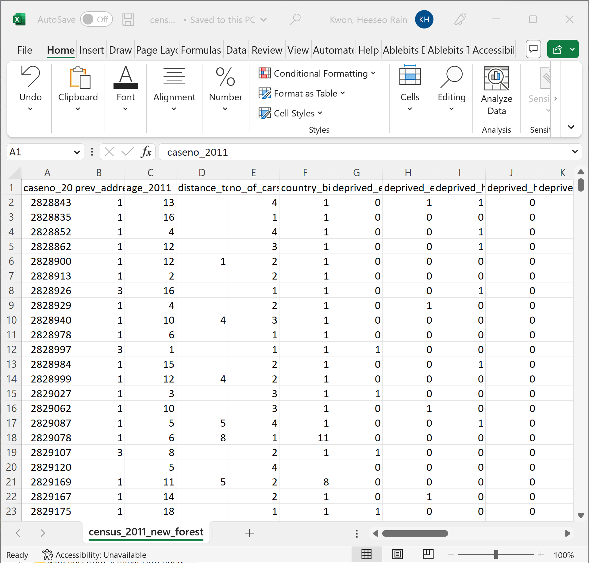
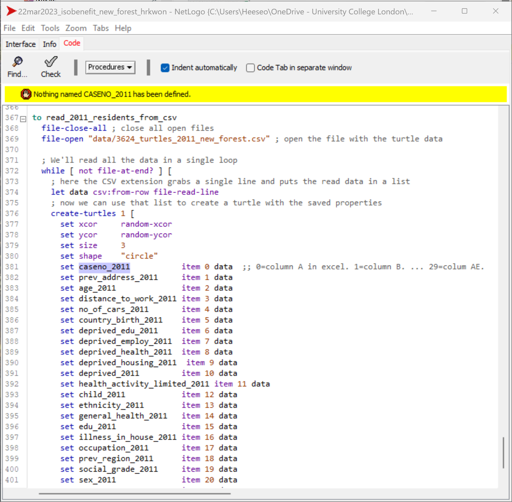
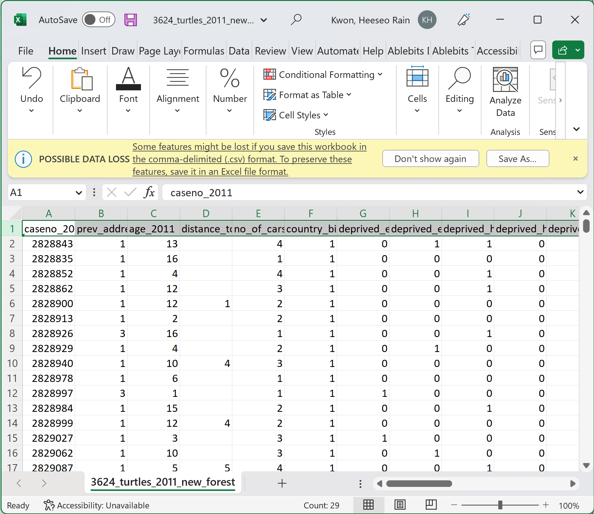
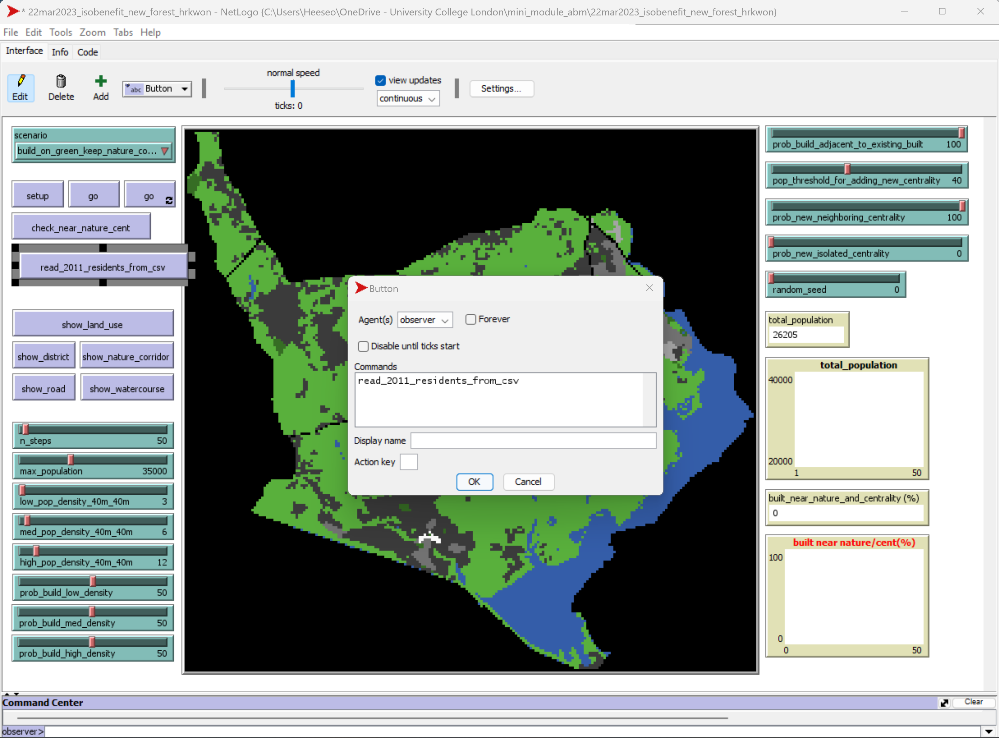
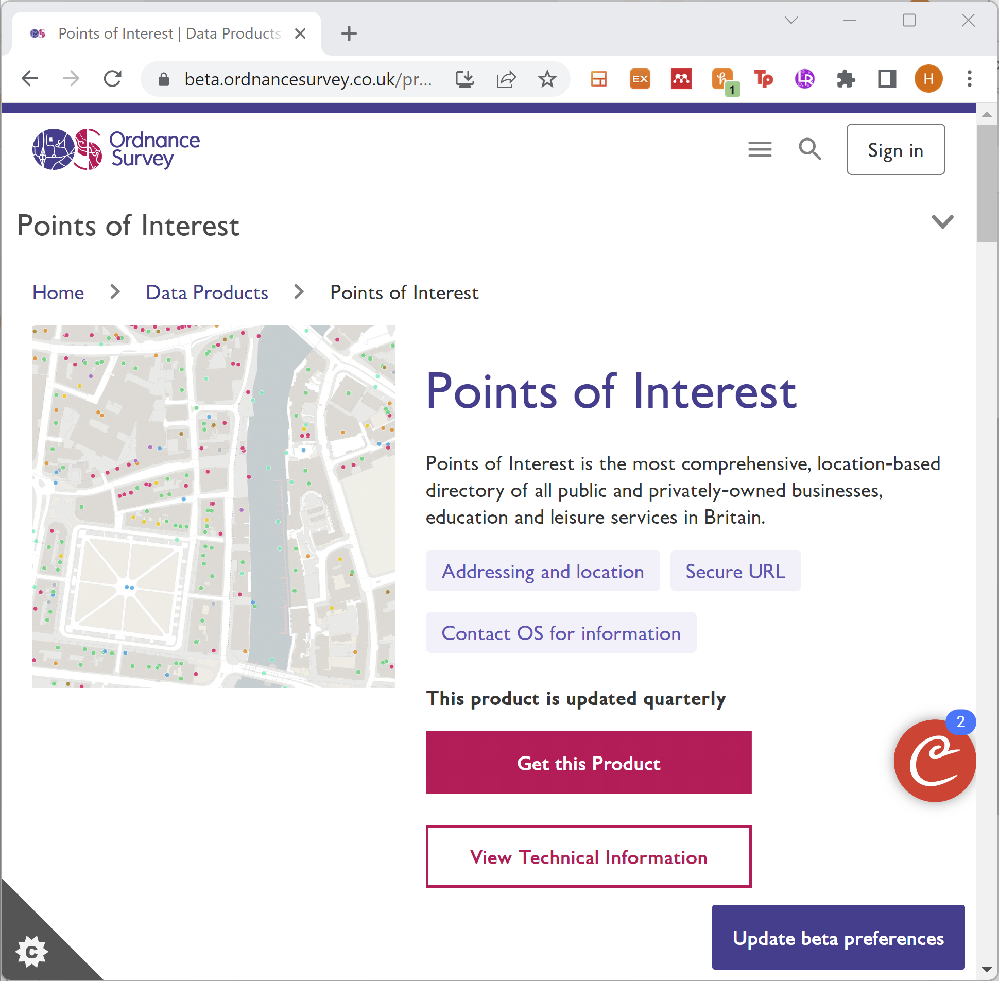
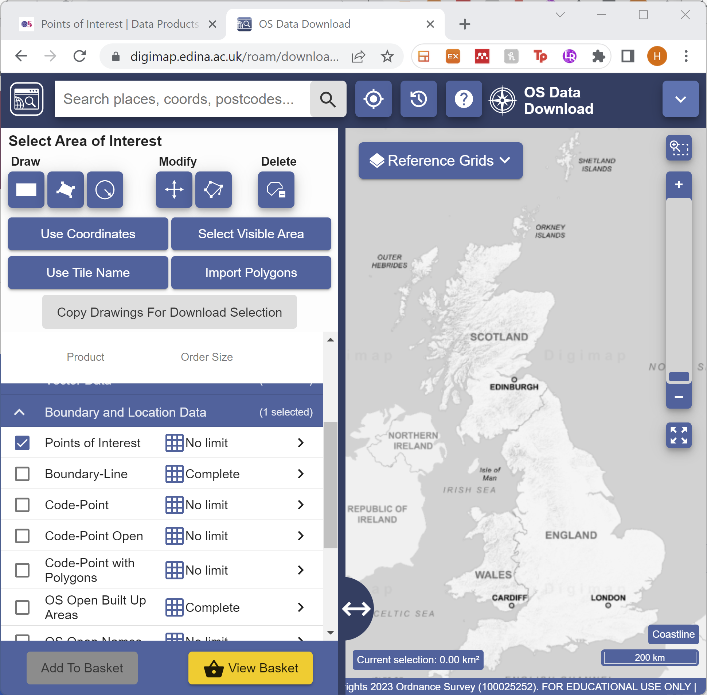
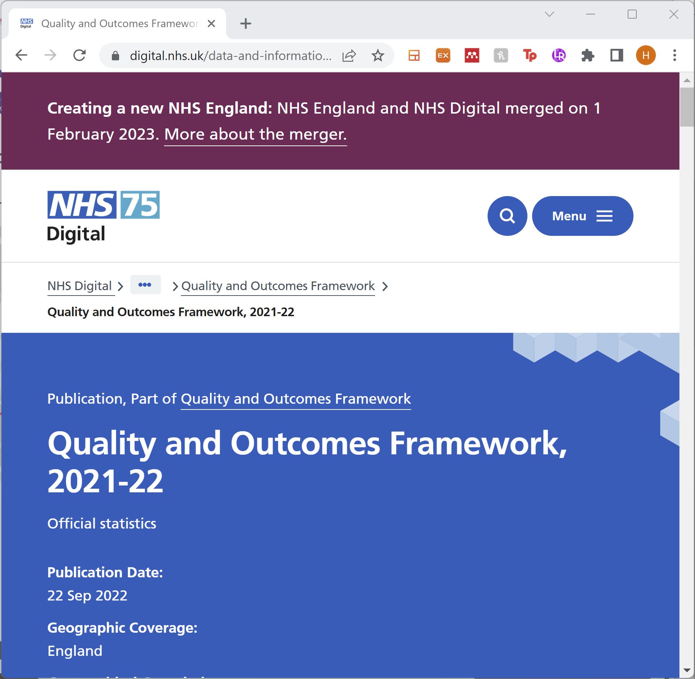
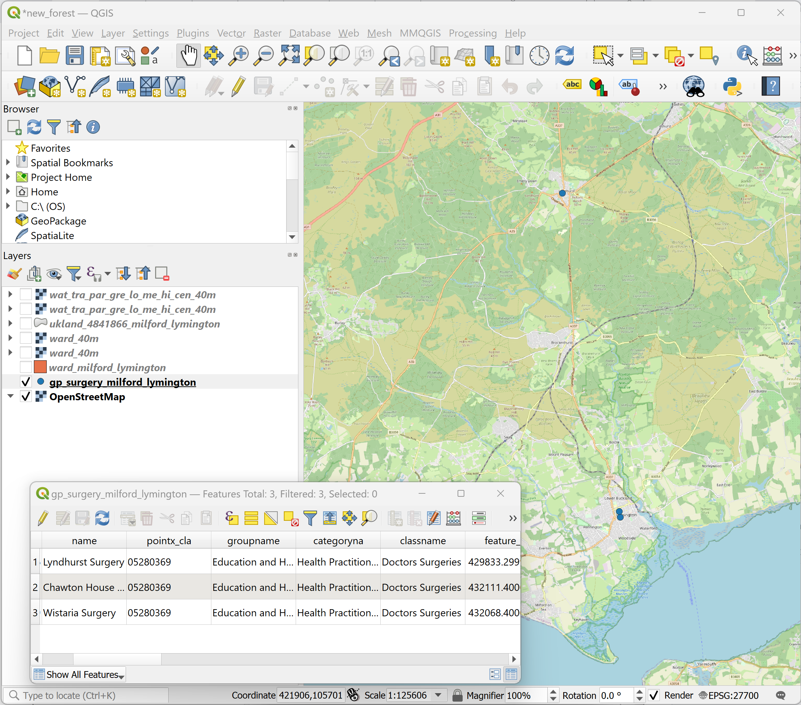
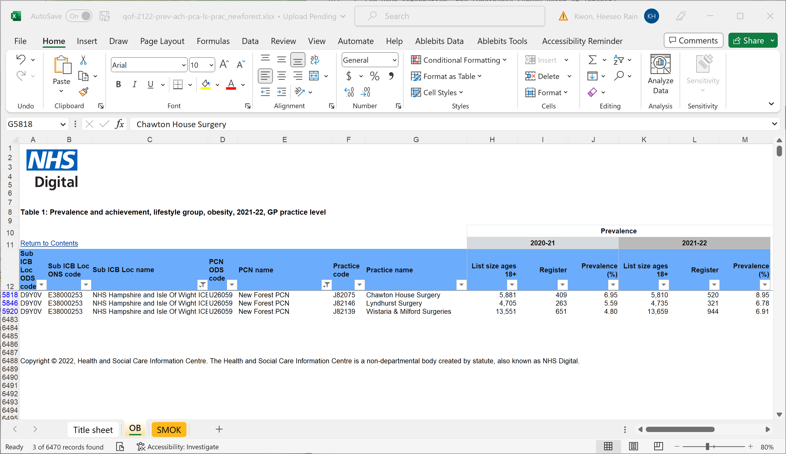
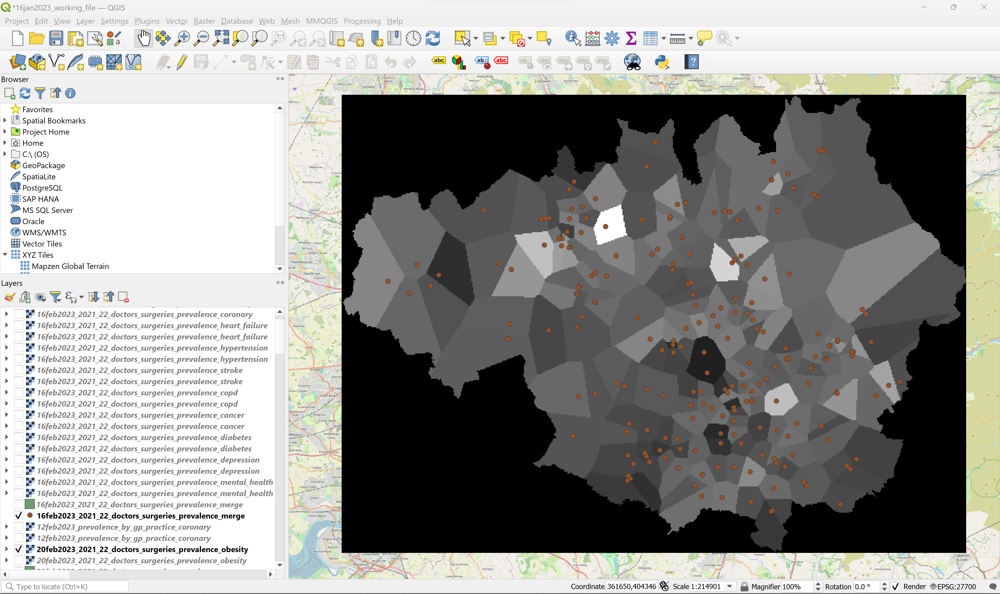

<button class="btn js-toggle-dark-mode">Dark color scheme</button>

<script type="text/javascript" src="{{ "/assets/js/dark-mode-preview.js" | absolute_url }}"></script>

# Software exercise 4: Using QGIS and Excel with NetLogo (20 minutes)
### Teaching materials are prepared by Dr Heeseo Rain Kwon (heeseo.kwon.10@ucl.ac.uk). 
- You would have received introduction to using census and health data with NetLogo in the lecture right before this exercise. This exercise will give a quick taster of how you can actually do this.

### Example 1: Linking census data with turtles using CSV extension (10min)
- Go through at your own pace.
- To show you how CSV extension works, we will continue to use the Isobenefit model from the previous exercise.

1. If not already opened, open the file `22mar2023_isobenefit_new_forest_hrkwon.nlogo`.

2. Download the census microdata of the case area: [census_2011_new_forest.csv](https://github.com/heeseorain/mini_module_abm/blob/master/data/census_2011_new_forest.csv){:target="_blank"} and save it in your working directory (e.g. your "mini_module_abm" folder).
- Note: I've prepared this csv file for this exercise session based on the 2011 Census microdata. Note that this csv file contains residents of the New Forest district, which is larger than our case area.
- For more information, see [Census 2021 microdata](https://www.ons.gov.uk/census/2011census/2011censusdata/censusmicrodata){:target="_blank"}. If you want, you can download the Microdata Teaching File and explore in your own time.

3. Open the file and have a quick look.

   

4. In the `Code` tab of the `22mar2023_isobenefit_new_forest_hrkwon.nlogo` model, we're going to add the `csv` extension next to `gis`.
- For more information, have a look at [NetLogo CSV Extension](https://ccl.northwestern.edu/netlogo/docs/csv.html){:target="_blank"}.

5. Insert the following code at the very bottom.
- Have a look at the code. What do you think we're trying to do here?
- (Note: set size as `1` rather than `3`.)

   ```
   to read_2011_residents_from_csv
     file-close-all ; close all open files
     file-open "data/3624_turtles_2011_new_forest.csv" ; open the file with the turtle data

     ; We'll read all the data in a single loop
     while [ not file-at-end? ] [
       ; here the CSV extension grabs a single line and puts the read data in a list
       let data csv:from-row file-read-line
       ; now we can use that list to create a turtle with the saved properties
       create-turtles 1 [
         set xcor     random-xcor
         set ycor     random-ycor
         set size     1
         set shape    "circle"
         set caseno_2011           item 0 data  ;; 0=column A in excel. 1=column B. ... 29=colum AE.
         set prev_address_2011     item 1 data
         set age_2011              item 2 data
         set distance_to_work_2011 item 3 data
         set no_of_cars_2011       item 4 data
         set country_birth_2011    item 5 data
         set deprived_edu_2011     item 6 data
         set deprived_employ_2011  item 7 data
         set deprived_health_2011  item 8 data
         set deprived_housing_2011  item 9 data
         set deprived_2011         item 10 data
         set health_activity_limited_2011 item 11 data
         set child_2011            item 12 data
         set ethnicity_2011        item 13 data
         set general_health_2011   item 14 data
         set edu_2011              item 15 data
         set illness_in_house_2011 item 16 data
         set occupation_2011       item 17 data
         set prev_region_2011      item 18 data
         set social_grade_2011     item 19 data
         set sex_2011              item 20 data
         set tenure_2011           item 21 data
         set travel_mode_to_work_2011 item 22 data
         set travel_mode_to_work_2001 item 23 data
         set place_of_work_2011 item 24 data
         set live_near_work_2011 item 25 data
         set workplace_2011 item 26 data
       ]
     ]
       ask turtles [move-to one-of patches with [wat_tra_par_gre_lo_me_hi_cen = 5 
         or wat_tra_par_gre_lo_me_hi_cen = 6 or wat_tra_par_gre_lo_me_hi_cen = 7]] ;; to residential patches.
   file-close ; make sure to close the file
   end
   ```

   

6. As our code will attach each row of the `census_2011_new_forest.csv` file as a turtle, we need to remove the first row that contains variable names.
- `Save as` the `census_2011_new_forest.csv` file into `3624_turtles_2011_new_forest.csv`.
- Delete the first row and `Save`.
- Put the `3624_turtles_2011_new_forest.csv` file inside the `data` folder of your `22mar2023_isobenefit_new_forest_hrkwon` folder in your working directory.

   

7. Let's go back to the `Code` tab of the `22mar2023_isobenefit_new_forest_hrkwon.nlogo` model. Click `Check`. You will see an error message `Nothing named CASENO_2011 has been defined.`
- We're trying to set these census variables as turtle properties.
- When you scroll to the top of the `Code` tab, you will see `patches-own`. These are the attributes of the land parcels in this model. We have set some of these linking with the raster files earlier.
- We can do the same for turtles with `turtles-own`.

   

8. Insert the following code below the `patches-own` section. For your reference, I have put the information of what the values under each variable indicate. 

   ```
   ; ##################################################################
   ; Turtle attributes
   ; ##################################################################
   turtles-own[
     caseno_2011 ;; Census case no.
     prev_address_2011 ;; add1yr. Address one year ago. 1=same, 2=other address within LA, 3=other address outside LA, within UK
          ;; 4=other address outside UK
     age_2011 ;; ageh. Age of individual (grouped). 1=0-4, 2=5-9, 3=10-15, 4=16-18, 5=19-24, 6=25-29, 7=30-34, 8=35-39, 9=40-44,
          ;; 10=45-49, 11=50-54, 12=55-59, 13=60-64, 14=65-69, 15=70-74, 16=75-79, 17=80-84, 18=85-89, 19=90+
     distance_to_work_2011 ;; aggdtwpew11g. Distance travelled to work. 1=less than 2km, 2=2 to <5km, 3=5 to <10km, 4=10 to <20km,
          ;; 5=20 to <40km, 6=40 to <60km, 7=60km+, 8=at home, 9=no fixed place, 10=work outwide England but within UK
          ;; 11=Work outside UK, 12=Works at offshore installation (within UK)
     no_of_cars_2011 ;; carsnoc. No. of cars and vans. 1=1, 2=2, 3=3, 4=4 or more
     country_birth_2011 ;; cobg. Country of birth. 1-5=Europe: UK, 6-9=Europe: non-UK, 10-13=Non-Europe.
     deprived_edu_2011 ;; depedhuk11. Education deprivation. 0=not deprived, 1=deprived.
     deprived_employ_2011 ;; depemhuk11. Employment deprivation. 0=not deprived, 1=deprived.
     deprived_health_2011 ;; dephdhuk11. Health/disability deprivation. 0=not deprived, 1=deprived.
     deprived_housing_2011 ;; dephshuk11. Housing deprivation (e.g. overcrowded). 0=not deprived, 1=deprived.
     deprived_2011 ;; Household deprivation. 0=no data. 1=not deprived. 2=deprived in 1 dimension, 3=deprived in 2 dimensions,
          ;; 4=deprived in 3 dimensions, 5=deprived in 4 dimensions  
     health_activity_limited_2011 ;; disabity. Long-term health problem. Day-to-day activities 1=limited a lot, 2=limited a little, 3=not limited
     child_2011 ;; dpcfamuk11. Family dependent children. 1=no, 2/4/6=includes youngest aged 0-9, 3/5/7=includes youngest aged 10-18  
     ethnicity_2011 ;; Ethnic group. 1 to 3=White, 4-5=Mixed/multi eth group, 6-10=Asian/Asian British,
          ;; 11-12=Black/African/Carib./Black British, 13=Other.  
     general_health_2011 ;; health. General health. 1=very good, 2=good, 3=fair, 4=bad, 5=very bad
     edu_2011 ;; hlqupuk11. Level of highest qualifications. 10=no, 11=level 1(0-4 GCSE), 12=level 2(5+ GCSE), 13=apprenticeship,
         ;; 14=level 3(2+ A levels), 15=level 4(degree), 16=other
     illness_in_house_2011 ;; illhuk11g. ilIndividuals in household with long-standing illness/disability. 0=no, 1=1, 2=2+.
     occupation_2011 ;; iscog. International Standard Classification of occupations. 1 = Commissioned armed forces officers
          ;; ... 96 = Refuse workers and other elementary workers
          ;; https://www.ons.gov.uk/file?uri=/census/2011census/2011censusdata/censusmicrodata/safeguardedmicrodata/codebooksafeguardedgroupedla_tcm77-398552.xls
     prev_region_2011 ;; moveregion. Region of origin 1 year ago (if moved). 1=migrant from outside UK, 2=North East, 3=North West, 4=Yorkshire and the Humber,
          ;; 5=East Midlands, 6=West Midlands, 7=East of England, 8=South East, 9=South West, 10=Inner London
          ;; 11=Outer London, 12=Scotland, 13=Wales, 14=Northern Ireland
     social_grade_2011 ;; scgpuk11c. Approximated social grade. 1=AB, 2=C1, 3=C2, 4=DE.
     sex_2011 ;; sex. 1=male, 2=female.
     tenure_2011 ;; tenduk. Tenure. 1=owns outright, 2=owns with mortgage/loan, 3=share ownership, 4=rents, 5=rent-free.
     travel_mode_to_work_2011 ;; transport. Method of travel to work. 1=work mainly at/from home, 2=underground/metro/light rail/tram, 3=train
          ;; 4=bus/minibus/coach, 5=taxi, 6=motorcycle/scooter/moped, 7=driving car/van, 8=passenger in car/van, 9=bicycle
          ;; 10=on foot, 11=other
     travel_mode_to_work_2001 ;; transport_2001. Method of travel to work (2001). 1=work mainly at/from home, 2=underground/metro/light rail/tram, 3=train
          ;; 4=bus/minibus/coach, 5=taxi, 6=motorcycle/scooter/moped, 7=driving car/van, 8=passenger in car/van, 9=bicycle
          ;; 10=on foot, 11=other
     place_of_work_2011 ;; wkpladdewni. 1=fixed location/reports to depot, 2=mainly works at/from home, 3=no fixed place,
          ;; 4=offshore installation, 5=outside UK
     live_near_work_2011 ;; wpzhome. Place of work. Comparison of where you live and work. 1=works at home,
          ;; 2=lives in same workplace zone/LGD as workplace, 3=lives outside zone, but within same LA/UA/district
          ;; 4=lives outside LA/UA/LGD area of workplace but within UK, 5=workplace outside UK
     workplace_2011 ;; wrkplaceew. 1=no fixed place. 2=work mainly at/from home, 3=inside LA area of residence, 4=outsidce LA area but inside GB
          ;; 5=Northern Ireland, 6=outside UK
   ]
   ```
   
   

9. Click `Check`. Seems like we are ready to run the `read_2011_residents_from_csv` command.
- We can simply put this in the `Command Center` and press `Enter`.
- But to show you how we make buttons in the `Interface`, let's make a button.
- First, let's move the two `go` buttons up to make room. Right-click > `Select` > Drag and drop.
- Next, right-click on the blank space > `Button` and write `read_2011_residents_from_csv`.

   

10. Click `read_2011_residents_from_csv`.
- What do you see happening?
- Right-click on one of the turtles and click `turtle` > `inspect turtle`.
  - Do you see each of these turtles representing each case number in the census data
- Save the NetLogo file if you wish to keep the changes that you made.

   

### Example 2: Linking NHS disease pravelence data (5min)
- Go through at your own pace.
- We will continue to use the Isobenefit model from the previous exercise.

1. Download the point data of [NHS GP surgeries in New Forest](https://github.com/heeseorain/mini_module_abm/blob/master/data/gp_surgery_milford_lymington.zip){:target="_blank"}. Extract the zip file.
- I've prepared this point file for this exercise session based on the Point of Interest (POI) data and NHS Quality and Outcomes Framework data.

2. For your information, the [Ordinance Survey Point of Interst](https://beta.ordnancesurvey.co.uk/products/points-of-interest){:target="_blank"} data is a very useful resource. 
- It includes detailed point data including restaurants, doctor's surgeries, pharmacies, fast food and takeway outlets, schools, bus stops...
- You can download this on Edina Digimap using your UCL login. If you're interested in using GIS data for your research, I recommend exploring this POI data.

   
   

3. For your information, digital.nhs.uk contains a lot of useful health data. 
- [Quality and Outcomes Framework](https://digital.nhs.uk/data-and-information/publications/statistical/quality-and-outcomes-framework-achievement-prevalence-and-exceptions-data/2021-22){:target="_blank"} gets updated annually and contains very useful information such as prevalence of various diseases by GP practices. 
- If you're interested in using health data for your research, I recommend exploring this data as well as other data on digital.nhs.uk.

   
    
4. Open your `new_forest.qgz` QGIS file in your working directory.
- Drag and drop `gp_surgery_milford_lymington.shp` into the `Layers` box.
- You will see three points.
- Right-click on `gp_surgery_milford_lymington.shp` > `Open Attribute Table` and have a quick look.

   
   
5. To give an example in this session, I extracted the three GP practices in `New Forest PCN` and in the POI data's attribute table, I entered the `Pravelence (%)` values of obesity by the GP surgery.
- New Forest PCN is not a dense area so only has three GP practice points in this NHS quality ad outcomes framework. You will see many more GP practice points in denser areas.

   

6. In the interest of time, we will not actually load this NHS data into NetLogo. Instead, I wish to explain what approches can be made to integrate this NHS data into our NetLogo model.
- Since we only have two GP practice points in the NHS quality and outcomes framework in our case area, located very close to each other, so we could just use the average obesity prevalence value of these two points (7.96%). 
- For example, hypothetically, we could randomly assign `obesity = 1 (yes)` to 7.96% of the turtles in our model.
  - We could consider census variables such as age and health deprivation  when randomly assigning certain disease types to turtles.
  - Also, we could make a `monitor` or `plot` for `obesity` and put a rule so that as turtles switch their main mode of transport from car to non-car, we can make this behavioural change affect the obesity metric. The details of this behavioural rules would need to be based on some evidence such as existing theories and empirical data.
- In larger areas or denser areas with more GP practice points, we can use [Voronoi Polygons](https://www.cadlinecommunity.co.uk/hc/en-us/articles/4404037109009-QGIS-Voronoi-Polygons){:target="_blank"} function in QGIS to make the points into polygons, export it as a raster file, and load on NetLogo with the GIS extension.
  - For example, this would be very useful for comparing the health metric among different wards/districts.
  - Below is an example from one of my current projects that uses Greater Manchester as a case study. 
  
   


### Questions (5min)
Q1. Going back to our NetLogo file, these turtles that we loaded can be coloured linked with their properties.
- For example, If one wants to look at 15-minute city/20-minute neighbourhood theme and mode swith away from car use,
  -  We can link with a census variable, by main mode of transport: non-car (green) and car (blue)).
  - Or can calculate within NetLogo, whether or not a turtle is within 1km of green cluster and centrality: yes (green), no (blue).
  - Naturally, we could put these as `monitor` or `plot` in the `Interface`.
- What kind of metric/s would be your personal interest?

Q2. I have only included the census variables that I thought would have relevance for car to non-car mode switch behaviour. You can see the whole list of variables in the census data in the [Codebook](https://www.ons.gov.uk/file?uri=/census/2011census/2011censusdata/censusmicrodata/safeguardedmicrodata/codebooksafeguardedgroupedla_tcm77-398552.xls){:target="_blank"}.
- Is there specific type/s of behaviour of citizens that you are interested in for research?
  - If so, which of these variables especially interest you?

Q3. What kind of opportunities do you think looking at the census data an an individual level create, compared to looking at them at an aggregate level?

Q4. What kind of opportunities do you think using GIS and CSV extensions in NetLogo can present for researchers and practitioners in urban planning and development?
