# Extra exercise: SLEUTH Urban Growth Model
### Teaching materials are prepared by Heeseo Rain Kwon (hk394@cam.ac.uk).

## Instructions
1. Read through the instruction carefully. You may face problems if you overlook any of the steps.
2. Remember to save the QGIS document regularly. 
3. When running tasks on QGIS, leave the settings as default unless instructed.
4. Some parts are labeled as `optional` which you can try in your own time at home if you wish.

Note: functions and filename are `highlighted` in this document.

## Preparing raster maps on QGIS (30min)

### QGIS project setup
1. Click `Project` > `New`.
2. Click `Project` > `Save As`, and save as `supervision2.qgz` to the working directory. 
3. Download dataset (sample data of Sejong, South Korea): [Urban_2018.zip](https://github.com/heeseorain/CamLandEc-RM03/blob/master/data/Urban_2018.zip){:target="_blank"}, [Exclusion_2014.zip](https://github.com/hn303/CamLandEc-RM03/blob/master/data/Exclusion_2014.zip){:target="_blank"}, [Road_2018.zip](https://github.com/heeseorain/CamLandEc-RM03/blob/master/data/Road_2018.zip){:target="_blank"}, and [Boundary.zip](https://github.com/heeseorain/CamLandEc-RM03/blob/master/data/Boundary.zip){:target="_blank"} in the working directory (you don't need to unzip). (Note: The original dataset are from the Korea National Spatial Infrastructure Portal. We have simplified and edited the file contents for the supervision).
4. Go to `Project` >  `Properties` in menu bar and open the `Project Properties` window.
    - `General` tab: Set your working directory as `Project Home`.
Note: after adding project home, you can find `Project Home` directory is showing in the `Browser panel`. It is much easier to locate your data files through this panel.
5. Drag `Urban_2018.shp` `Exclusion_2014.shp` `Road_2018.shp` `Boundary.shp` to the  `Layers panel`. Drag `Boundary.shp` to the bottom. Uncheck all layers except `Boundary.shp`. Note: You can check/uncheck the layer to make it visible/invisible by clicking the box next to the layer name in the `Layer panel`. 

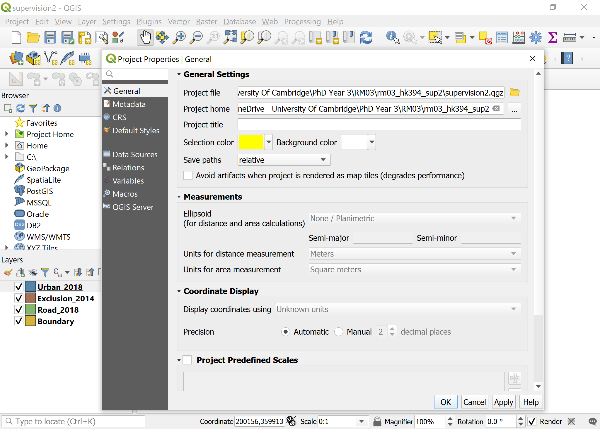

### Understanding the layer content through attribute table
1. You can see the attibute table of a layer by right-click > `Open Attibute Table`. `Urban_2018` layer is a combination of urban land-use data by parcel and building data, with the urban parcels coded 100 in the field `URBAN`. `Exclusion_2014` layer is a combination of river, urban parks, and development restriction zone, with non-excluded areas coded 0 and excluded areas coded 100 in the field `EXCLUSION`. `Road_2018` layer contains roads, with the road-class information coded in the field `road_class` (25=small road, 50=medium road, 75=large road, 100=expressway).`Boundary` layer contains the administrative boundary of the city in the field `boundary` (within boundary=1).

### Using symbology to assign colour to visualize the data
1. Let us assign colour for `Boundary` and `Urban_2018` layers only just to see what they look like.
2. Right-click on `Boundary` layer > `Properties` > `Symbology` (or double-click the color box). Click `Simple fill`, change `Fill color` to `black`, change `Stroke style` to `No Pen`, click `OK`. 
3. Check `Urban_2018` layer, double-click the color box. Click `Simple fill`, change `Fill color `to `white`, change `Stroke style` to `No Pen`, click `OK`.

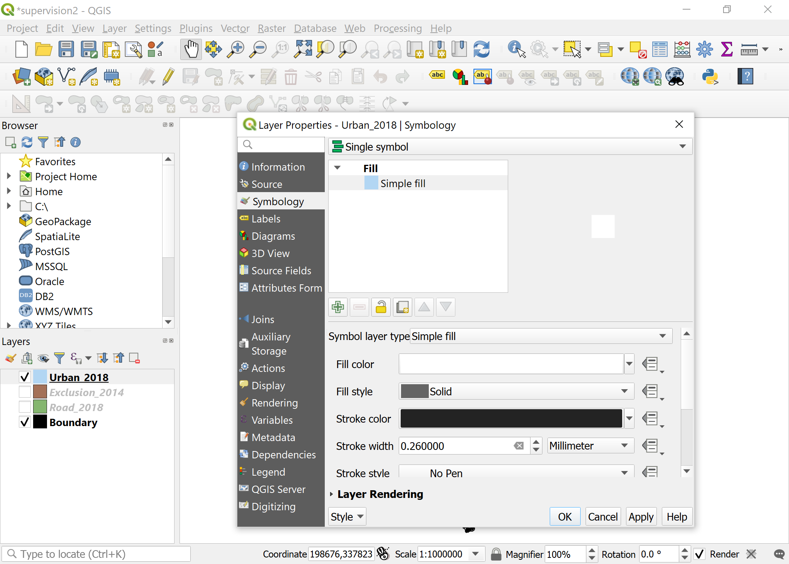  

### OPTIONAL 1: Using symbology to assign colour to visualize the data
1. You can assign colour for other layers too if you wish. Uncheck `Urban_2018` layer, check `Exclusion_2014` layer, double-click the color box. Click `Single symbol` > `Categorized`, click `Column` > `Exclusion`, click `Classify` and change `Legend` to 0=non-excluded, 100=excluded.
2. Double-click the color box of non-excluded, click `Simple fill`, change `Fill color` to `black`, change `Stroke style` to `No Pen`, click `OK`. Double-click the color box of excluded, click `Simple fill`, change `Fill color` to `white`, change `Stroke style` to `No Pen`, click `OK`. 
3. Delete the third row (unnecessary) by pressing the `negative sign` next to `Classify`. Click `OK`.

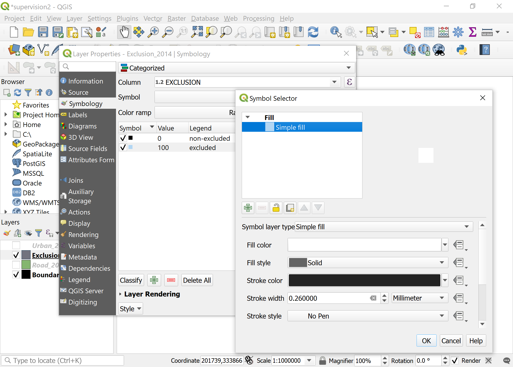 

6. Uncheck `Exclusion_2014` layer, check `Road_2018` layer, double-click the color box. Click `Single symbol` > `Categorized`, click `Column` > `road_class`, click `Classify` and change `Legend` and `color` to the following with `No Pen`: 25=small road (#404040), 50=medium road (#808080), 75=large road (#3a3a3a), 100=expressway (white). Click `OK`. Note: The road classifications are coded from 25 because we want to have 0=non-road.

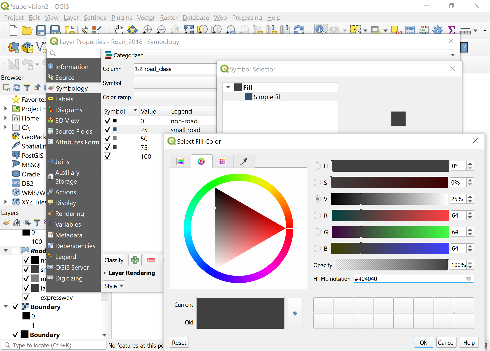 

### Converting vector to raster (rasterize)
1. Click and check `Urban_2018` layer, click `Raster` in menu bar, `Conversion` > `Rasterize`. Set `Field to use for a burn-in value` as `URBAN`, `A fixed value to burn` as `Not set`, `output raster size units` as `Georeferenced units`, and `Resolution` as `30` and `30`.
2. Set `Output extent` as `211290.7980001302785240, 236760.7980001302785240, 322863.2411839000415057, 359223.2411839000415057`. Set `Nodata value` as `Not set`. Click `Run`.
Note: Numbers of the output extent came from the layer with the largest layer extent. Keeping the output extent same for all layers is important when loading them on NetLogo.

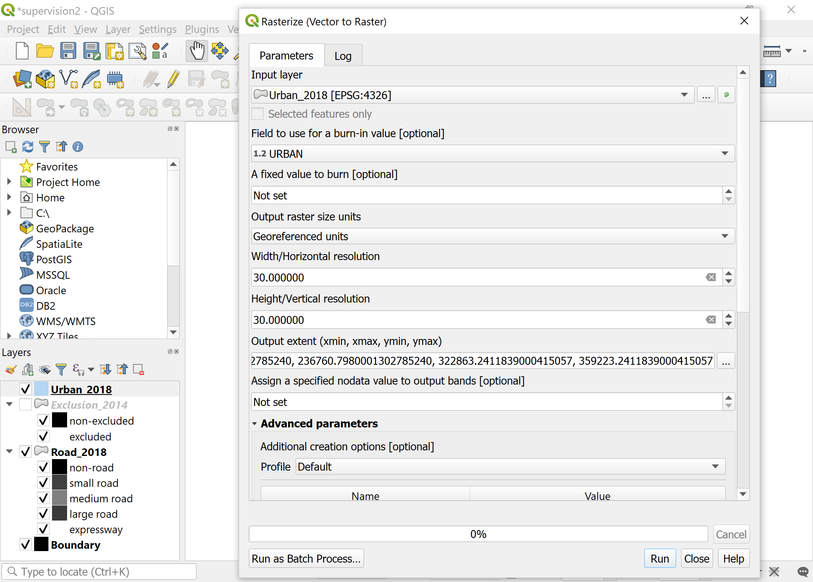 

3. Right-click on the newly created temporary `Rasterized` layer, click `Export` > `Save As`. Set `File name` as `Urban_2018.tif`, click `OK`. You can now right-click `Rasterized` layer and click `Remove Layer`.
Note: If you don't save as, these temporary files will disappear next time you open the QGIS file.

 

### In-class questions
#### Question 1. Uncheck all layers except two `Urban_2018` layers and `Boundary`. Compare `Urban_2018.tif` with `Urban_2018.shp` by turning on and off the check of the raster layer. Zoom into the layer. How is the raster data different from vector data?

#### Question 2. Zoom into the `Urban_2018.tif` layer. You will see that the pixels are in a grid. Check the size of the grid by right-clicking on the layer and clicking `Properties`. In the `Information` tab, what are the dimensions and pixel size? (Note: pixel size is in meters)

#### Question 3. In real life, what would be the dimension (width and length on a map) of this city of Sejong, South Korea in kilometers? (hint: real distance = dimension * pixel size). Find this city on [Google Map](https://www.google.com/maps/place/Sejong+City+Hall/@36.5675237,127.1919615,11z/data=!4m5!3m4!1s0x357ad2abe6c47565:0x4da638f5f9f95e37!8m2!3d36.4800984!4d127.2890354){:target="_blank"} to see whether your calculation makes sense. You can search Sejong City Hall, and refer to the grey dotted line as the city boundary.

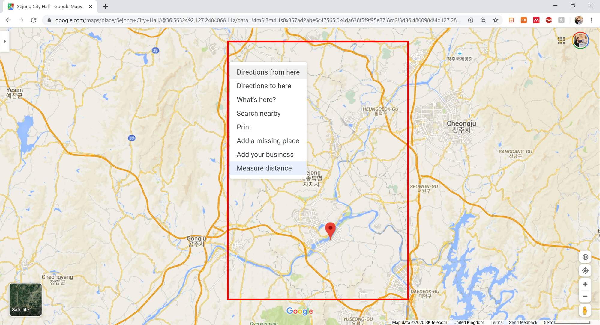 

### Converting GeoTIFF (.tif) to ASCII (.asc) to load on NetLogo

1. Check and click on `Urban_2018.tif` layer and uncheck all other layers. On the `Menu bar`, click `Raster` > `Conversion` > `Translate`. Under `Converted`, click `Save to File` and save as `Urban_2018.asc`. (Note: This is because the SLEUTH model we will be using on NetLogo accepts ASCII files)
5. In the interest of time, please download the `asc` files for other three layers: [asc_and_csv.zip](https://github.com/heeseorain/CamLandEc-RM03/blob/master/data/asc_and_csv.zip){:target="_blank"}. This `zip` file also contains `Slope_2014.csv` for next step of the exercise. Unzip and move the four files: `Boundary.asc`, `Exclusion_2014.asc`, `Road_2018.asc` and `Slope_2014.csv` to your QGIS working directory. (Note: The original data is from the Korea National Spatial Infrastructure Portal.)

### OPTIONAL 2: Converting vector to raster (rasterize)
4. You can rasterise the other layers yourself too if you wish. Uncheck `Urban_2018` layer. Click and check `Excluson_2014` layer, click `Raster` in menu bar, `Conversion` > `Rasterize`. Set `Field to use for a burn-in value` as `EXCLUSION`, `A fixed value to burn` as `Not set`, `output raster size units` as `Georeferenced units`, and `Resolution` as `30` and `30`.
5. Set `Output extent` as `211290.7980001302785240, 236760.7980001302785240, 322863.2411839000415057, 359223.2411839000415057`. Set `Nodata value` as `Not set`. Click `Run`.

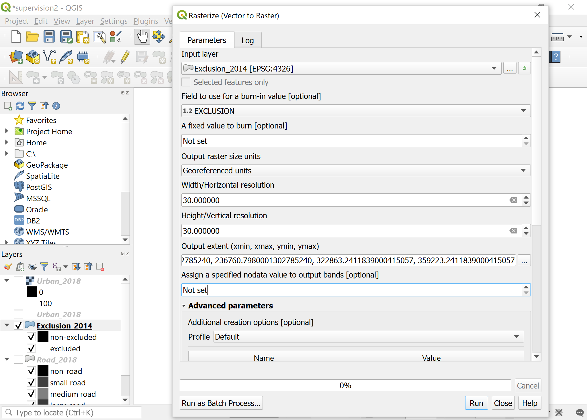 

6. Right-click on the newly created `Rasterized` layer, click `Export` > `Save As`. Set `File name` as `Exclusion_2014.tif`, click `OK`. You can now right-click `Rasterized` layer and click `Remove Layer`.
7. Repeat the exact same `Rasterize` task on `Road_2018` layer using `road_class` as the `Field to use for a burn-in value`. `Save As` the temporary layer to `Road_2018.tif` and remove the temporary layer.
8. Repeat the exact same `Rasterize` task on `Boundary` layer using `boundary` as the `Field to use for a burn-in value`. `Save As` the temporary layer to `Boundary.tif` and remove the temporary layer.
9. Check and click `Road_2018` raster layer and zoom in. Use `Identify Features` button on menu bar (information sign + cursor) and click on the road pixels on the map to check that the grids are coded correctly (0=non-road, 25=small road, 50=medium road, 75=large road, 100=expressway).

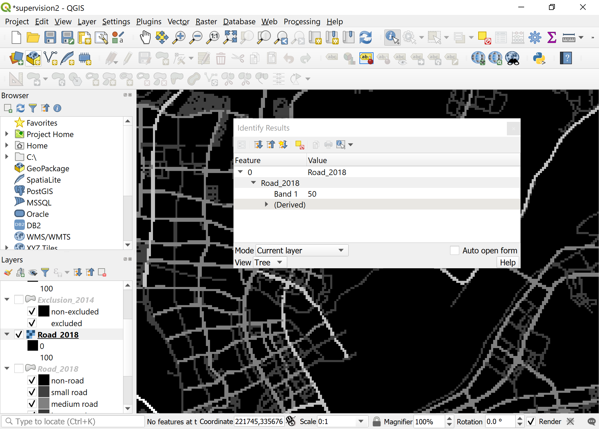 

### Importing DEM data in `csv` as delimited text layer
1. On the `Menu bar`, click `Layer` > `Add Layer` > `Add Delimited Text Layer`. Add `Slope_2014.csv` with  `Point coordinates`. 

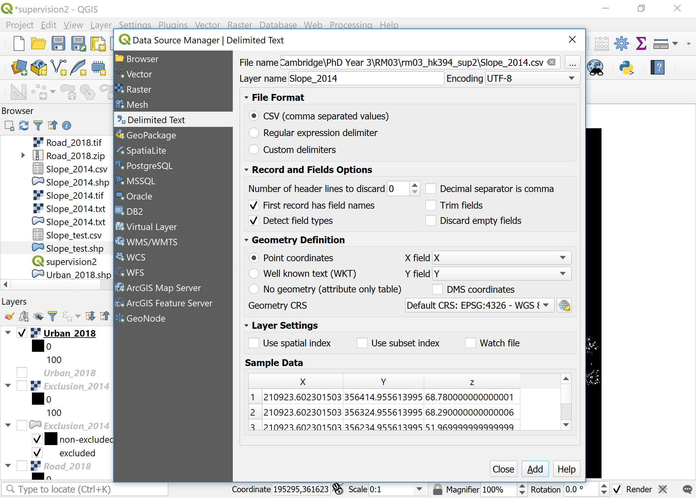

2. Right-click on `Slope_2014` layer (this is a temporary layer) > `Export` > `Save Feature As`. Set `File name`as `Slope_2014.shp` > `OK`. Remove the other temporary `Slope_2014` layer. Note: You can check the file type of the layers by lingering the cursor on the layer name, or by right-clicking > `Properties` > `Information tab`.

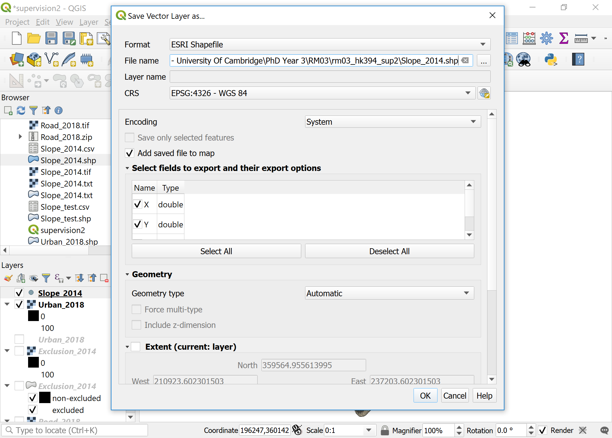

### Interpolating the DEM data
1. On the `Menu bar`, click `Processing` > `Toolbox`, search `interpolation`, and double-click `Inverse distance weighted interpolation` under `SAGA`. Note: `IDW interpolation` under `QGIS Interpolation` in the `Processing Toolbox` does a similar job but takes much longer so we use a SAGA tool instead.

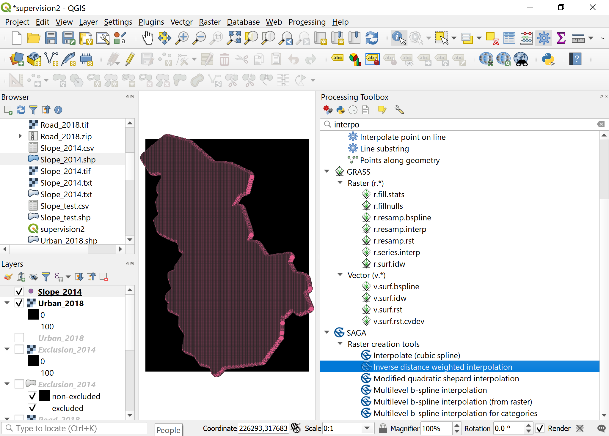

2. Set `Attribute` as `z` and `Cellsize` as `30`, and click `Run`. `Close` afterwards.
3. The newly created `Grid` is a temporary file. Right-click and `Export` > `Save As` > `Interpolation.tif`. Leave everything else as default > `OK`. Remove the `Grid` layer.

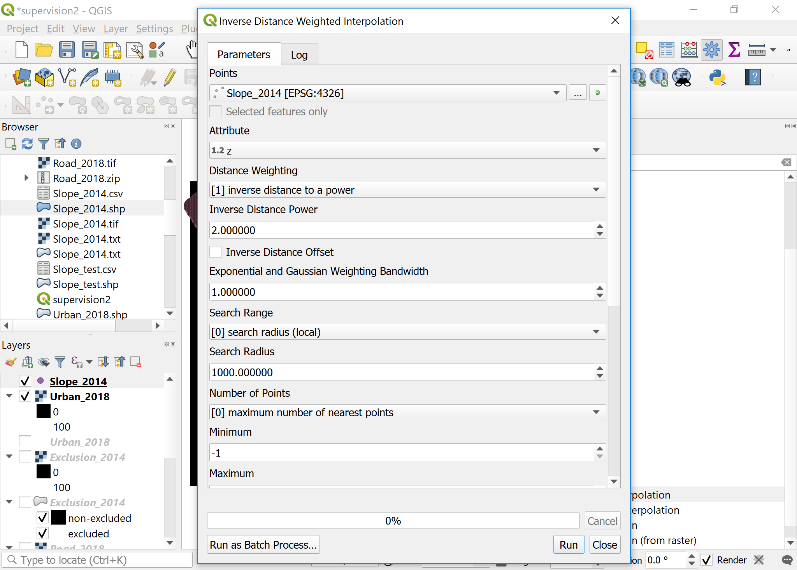
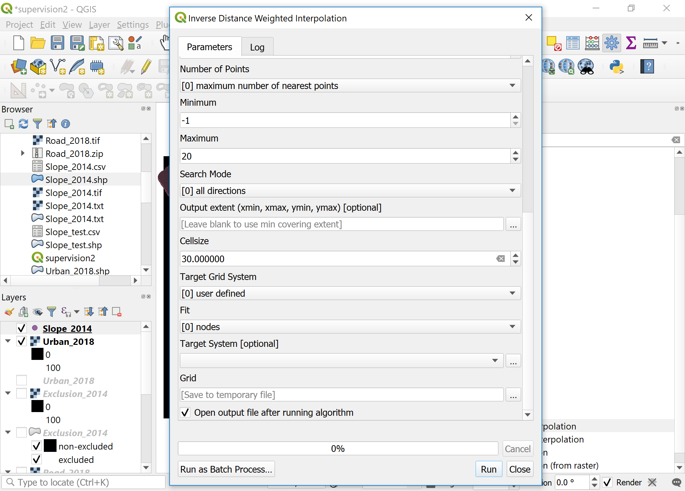
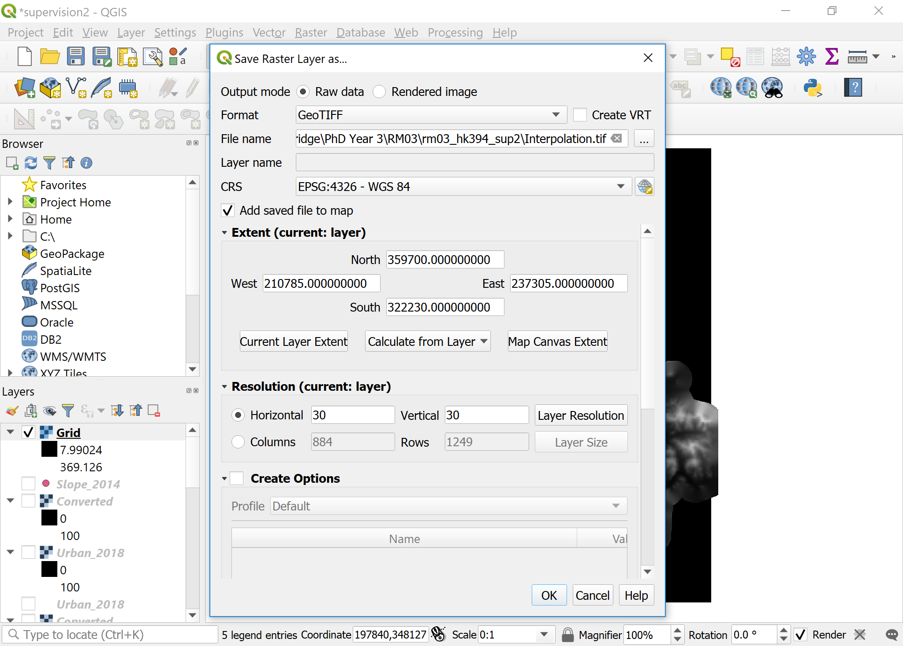

#### Generating slope in percent from interpolated data
4. Click the `Interpolation` layer. On the `Menu bar`, click `Raster` > `Analysis` > `Slope`. Check `Slope expressed as percent instead of degrees` and click `Run` > `Close`.

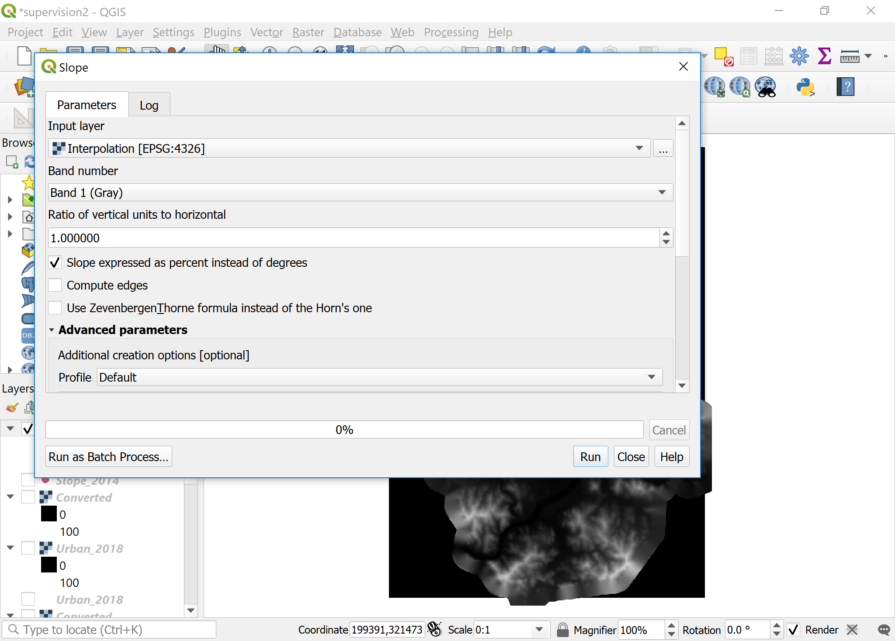

5. Right-click on `Slope` layer (this is a temporary layer) > `Export` > `Save As`. Set `File name` as `Slope_2014.tif`, click `Calculate from Layer` and choose any of the four raster layers created previously (`Boundary`, `Exclusion_2014`, `Road_2018`, and `Urban_2018`). You will notice that the extent is same in all these layers. Check that `Resolution` is set as `30`. Click `OK`.
6. Click on `Slope_2014.tif` layer. On the `Menu bar`, click `Raster` > `Conversion` > `Translate`. Under `Converted`, click `Save to File` and save as `Slope_2014.asc`.
7. Check the `Properties` > `Information` of all five raster layers (`Slope_2014.asc`, `Urban_2018.asc`, `Exclusion_2014.asc`, `Road_2018.asc`, and `Boundary.asc`) and check that they have identical dimensions, origin, and pixel size. We are now ready to import them to NetLogo! Don't close QGIS yet.

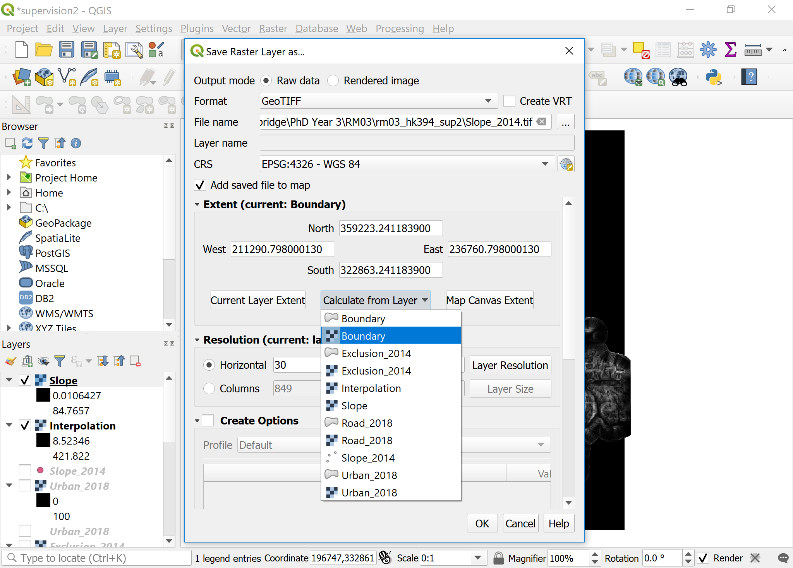
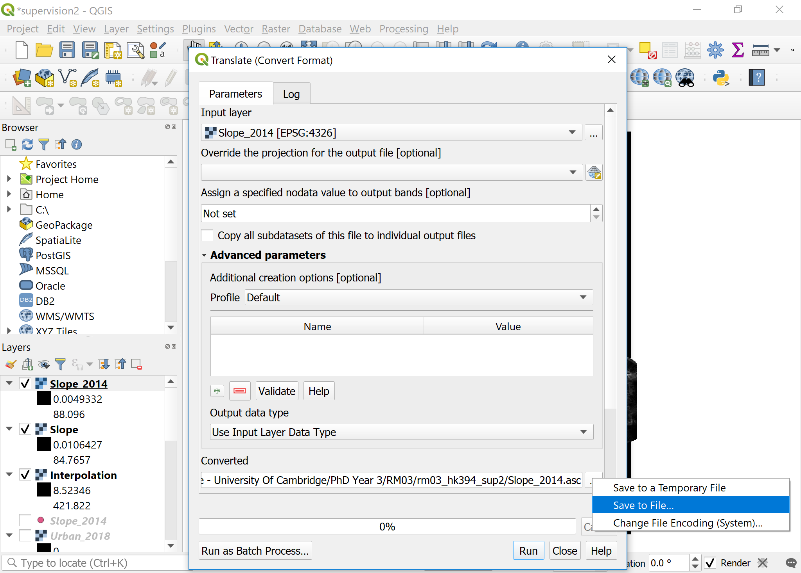

Note: As this supervision is for introducing how QGIS and raster data can be used on NetLogo, we cannot cover many other functions available on QGIS. Please refer to [QGIS Training Manual](https://docs.qgis.org/2.8/en/docs/training_manual/create_vector_data/index.html){:target="_blank"} for more information.

## Introducing NetLogo (10min)

### Setup work environment for NetLogo
1. Continue using `rm03_YourCRSid_sup2` as your working directory.
2. Launch NetLogo. The interface will be explained along with exercises. Note: You can refer to [NetLogo User Manual (6.1.1)](https://ccl.northwestern.edu/netlogo/docs/){:target="_blank"} for more detailed information.
3. In `File` > `Models Library`, you can find a collection of sample models to explore. There are many sample models available on the User Community Models web page.

### Exercise 1: Wolf Sheep Predation
1. Open `Wolf Sheep Predation` from `Models Library` under `Biology` folder.

2. Click `setup` > `go` to start the simulation, and click `go` agin to stop the simulation.
3. Try running the model with following changes and explain what happens:
- Change the `model-version` to `sheep-wolves-grass`. Sheep and wolves are the moving agents (turtles in NetLogo), and grass form a grid of stationary agents (patches).
- Decrese wolf poplulation.
- What other sliders/switches can you adjust to help out the sheep population?
- Can you find any parameters that generate a stable ecosystem?

## Running the SLEUTH Urban Growth Model on NetLogo using the raster data produced in QGIS (30min)

### Setting the work environment
1. Download `ZIP` of the partial reimplementation of SLEUTH urban growth model on NetLogo and save it at your prefered directory on your disk (e.g. `rm03_YourCRSid_sup2`). : [Urban Growth Model](https://github.com/YangZhouCSS/Urban_Growth_Model){:target="_blank"}.
2. Unzip `Urban_Growth_Model-master.zip` and further unzip `urban_growth_model.zip`. In the `urban_growth_model` > `urban model` folder, open `Urbanization.nlogo`. 
3. Click `setup` > `go` to try out. Inside `urban model` folder, open `data` folder, and you will see the asc files of Santa Fe, New Mexico. Copy-paste the five asc raster files that we created for Sejong: `Slope_2014.asc`, `Urban_2018.asc`, `Exclusion_2014.asc`, `Road_2018.asc` and `Boundary.asc`.
4. `File` > `Save As` the netlogo file to `Urbanization_sejong.nlogo`. We will make changes to the code to suit our Sejong data. 

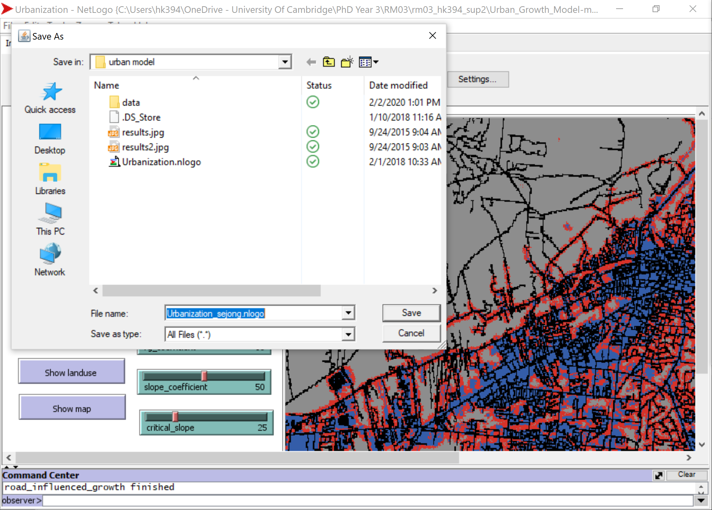

### Editing the code to suit our data
1. Go to the `code` tab. `extensions [gis]` is used for this model. (Note: More information on [NetLogo GIS extension](https://ccl.northwestern.edu/netlogo/docs/gis.html){:target="_blank"}. `globals` outlines the global variables accessible by all agents. 
2. `patches-own` outlines the variables that all patches can use. (Note: If you don't see line numbers, for Windows users, on the `Menu bar`, click `Tools` > `Preferences` and check `Show Line Numbers`. For Mac users, on the `Menu bar`, click `NetLogo` > `Preferences` and check `Show Line Numbers`.) 
- In line 18, add `boundary_dataset`.
- In line 25, for `road1`, change `from 1 to 4` to `from 25 to 100`.
- In line 32, for `excluded`, change `0 if excluded` to `0=non-excluded, 100=excluded`.
- Add `boundary ;;binary, 0=outside boundary, 1=within boundary`
3. Optional: You can load the Santa Fe `asc` files on QGIS to see which code refers to what. In Santa Fe raster files,
- Urban: 1 = non-urban, 2 = urban
- Road: 1 = small road, 2 = medium road, 3 = large road, 4 = expressway
- Exclusion: 0=excluded
- Slope: Discrete. Whole number between 1 and 21.
4.Back to the `Code` tab, in the `to setup` section, `ca` means `clear all`. We cannot go through all codes one by one due to time limitation, so you can refer to [NetLogo Dictionary] (http://ccl.northwestern.edu/netlogo/docs/index2.html){:target="_blank"} in your free time. Also, the setting of values and growth rules etc. are based on the original SLEUTH model (details can be seen in [Project Gigapolis website](http://www.ncgia.ucsb.edu/projects/gig/About/bkOverview.html){:target="_blank"} so we won't go through in detail. The objective of this exercise in this supervision is to introduce how raster maps generated in QGIS can be loaded on NetLogo and how a model directly applicable to urban planning like SLEUTH urban growth model can run on NetLogo based on a set of rules.
5. Line 62 asks road patches to set run_value. Change `road = 1` to `road > 0` and `road1 / 4` to `road1 / 100` since in the raster data for Sejong, 0=non-road and road value ranges up to 100.
6. In line 65, also change `road = 1` to `road > 0`.

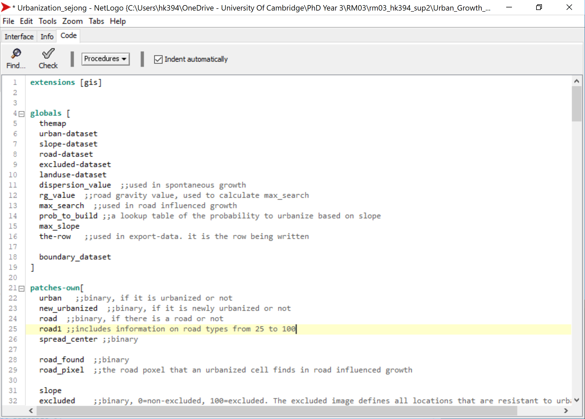
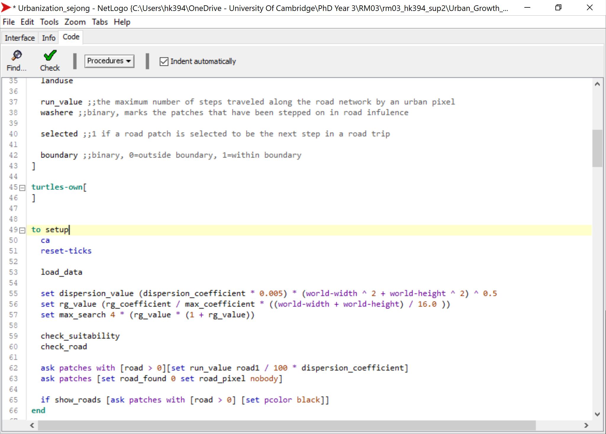

7. In line 83, change `road = 1` to `road > 0`.
9. In the `to load_data` section, change the Santa Fe data to `Urban_2018.asc`, `Slope_2014.asc`, `Road_2018.asc`, and `Exclusion_2014.asc`. 

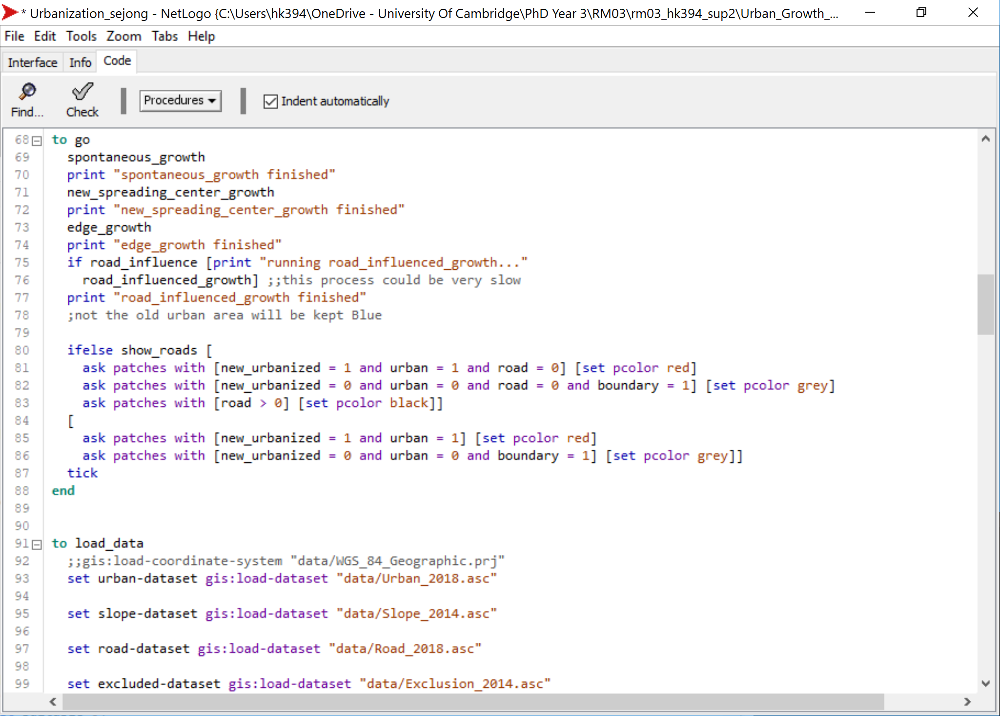

10. In line 101, disable the `set landuse-dataset` row by putting `;;` in front as we will not include this for this exercise (landuse data is not crucial for SLEUTH growth rules).
11. Add in line 103, `set boundary_dataset gis:load-dataset "data/Boundary.asc"`. This is because Sejong data uses the administrative boundary while Santa Fe data uses the whole of the rectangular extent.
12. In line 108, change `urban = 2` to `urban > 0` because urban cells in Santa Fe raster are coded 2 while in Sejong, 100. This model can be extended to include urban data as continuous (e.g. urban intensity) rather than binary, therefore, `urban > 0` is used rather than `urban = 100`. 
13. Add in line 116, `gis:apply-raster boundary-dataset boundary`
14. Add in line 117, `ask patches [if boundary = 0 [set pcolor black]]
15. In line 119, disable `gis:apply-raster landuse-dataset landuse` by putting `;;` in front.

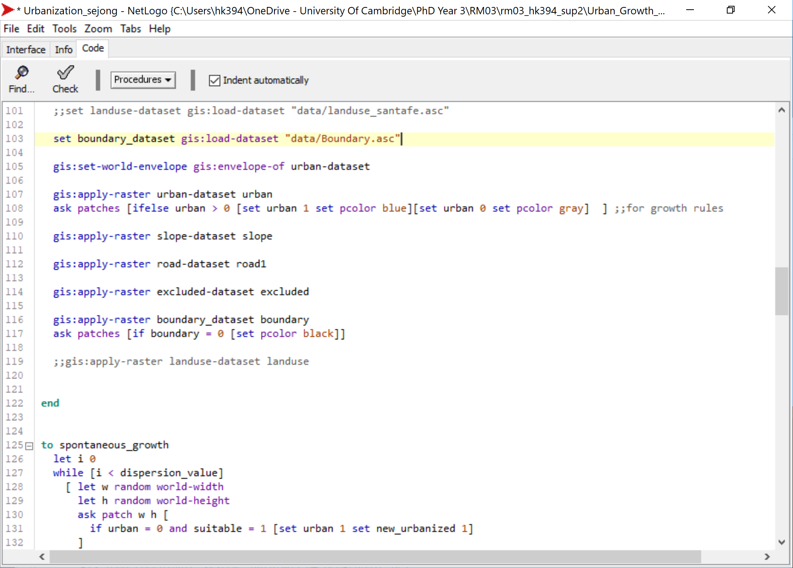

16. In line 161, change to `ask n-of tenpercent_urban (patches with [urban = 1])`. This is to fasten this procedure.
17. In line 170, 171 and 186, change `road = 1` to `road > 0`.

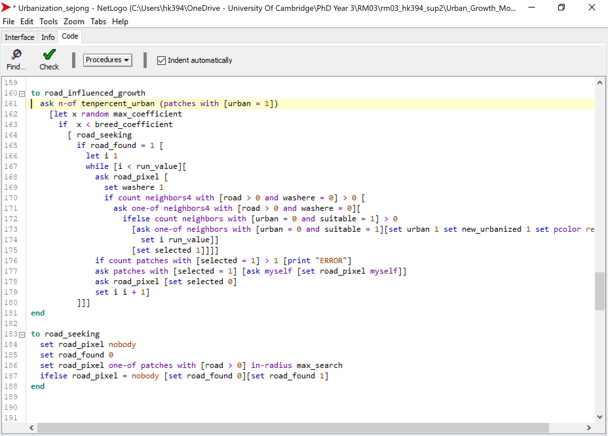

18. In the first line of the `check_suitability` remove the current :`set max_slope max [slope] of patches` and add:
- `set max_slope (max [slope] of patches with [( (slope <= 0) or (slope >= 0) )])` instead.
19. In line 210, change `excluded = 0` to `excluded = 100`. 
20. Add in line 211 `if boundary = 0 [set suitable 0]`.

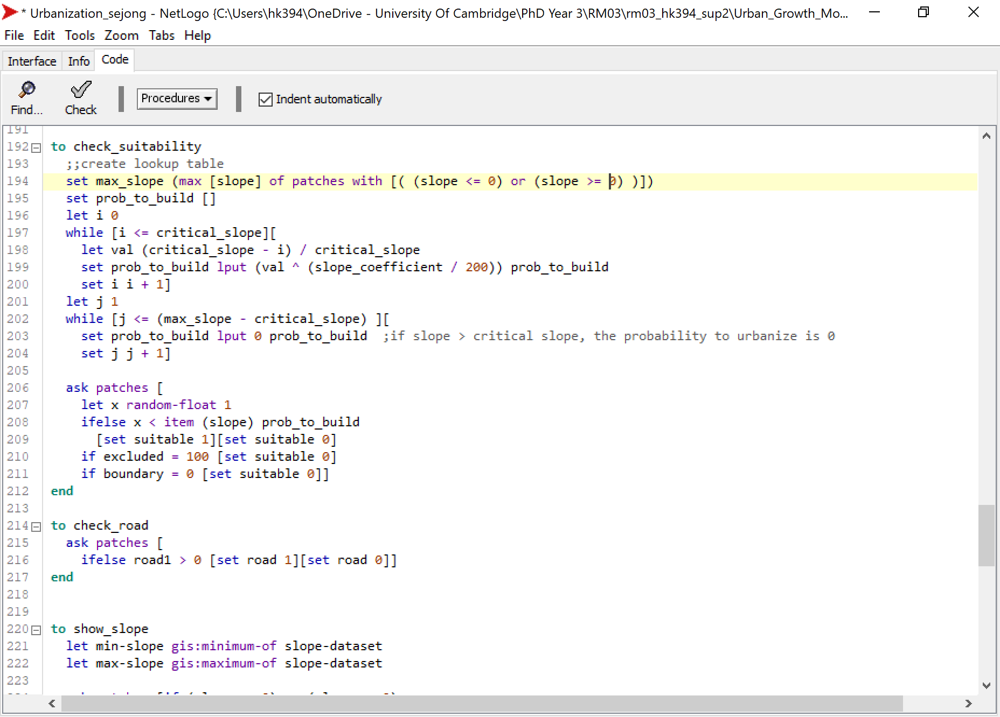

21. In line 240, change `road = 1` to `road > 0`.

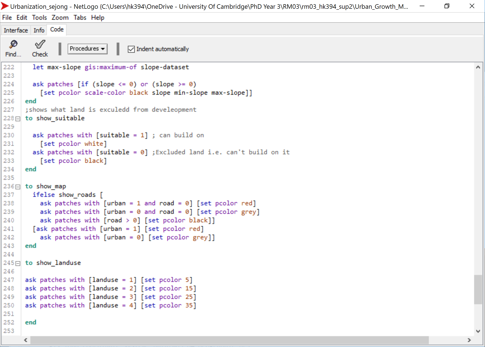

22. These do not affect the simulation, for optionally: In line 258, change `531` to `849`.
23. In line 259, change `394` to `1212`.
24. In line 260, change `-901575` to `211290.798000130308`
25. In line 261, change `1442925` to `322863.241183900100`.
26. Add in line 279 `to-report tenpercent_urban`
27. Add in line 280 `report (round (count patches with [urban = 1] * 0.10))`
28. Add in line 281 `end`. This is to define the value `tenpercent_urban` introduced earlier.
29. Click `Check` bottom next to `Find`. (Note: If an error message comes up for some reason, click `Dismiss` and try again twice. On the third go, the map will be loaded fine. If it still occurs, it might be due to typo, etc. Let one of the supervisors know, and in the interest of time, download the completed file [Urbanization_sejong.nlogo](data/Urbanization_sejong.nlogo){:target="_blank"} so that we can carry on. You can either put this file in the same working directory, or you can copy-paste this file's code to the NetLogo file that you have been working on.

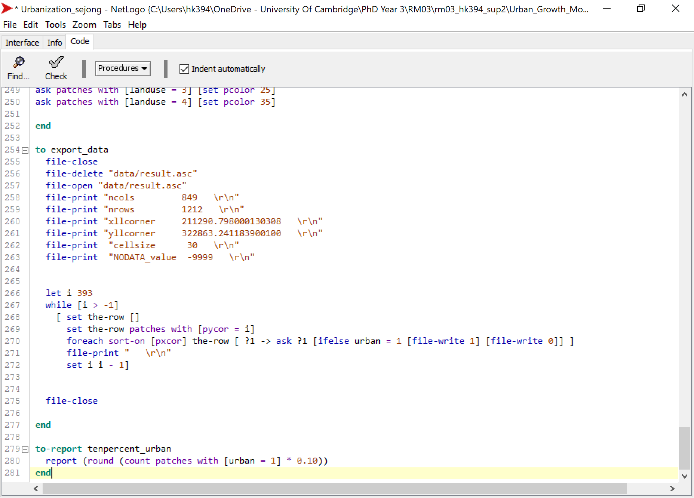

### Changing the model settings and running the simulation

1. Go back to `Interface` tab, click `setup`. You will see that the Sejong data have been loaded.
2. Click `go` and a few ticks and click `go` again. What happens?
3. Turn on the `road_influence` switch and run the model again. What difference do you see in the simulation?
4. Right-click on the map and click `Edit`. Change `max-pxcor` to `848` and `max-pycor` to `1211`. You will see that the Box is now changed to Sejong's raster dimension: 849 x 1212. Set patch size as `0.5` (or `0.3` and `0.1` depending on your screen resolution. Try several.) so that we can see the whole screen. (Note: If an error message comes up for some reason, click `Dismiss` and try again twice. On the third go, the map will be loaded fine.)

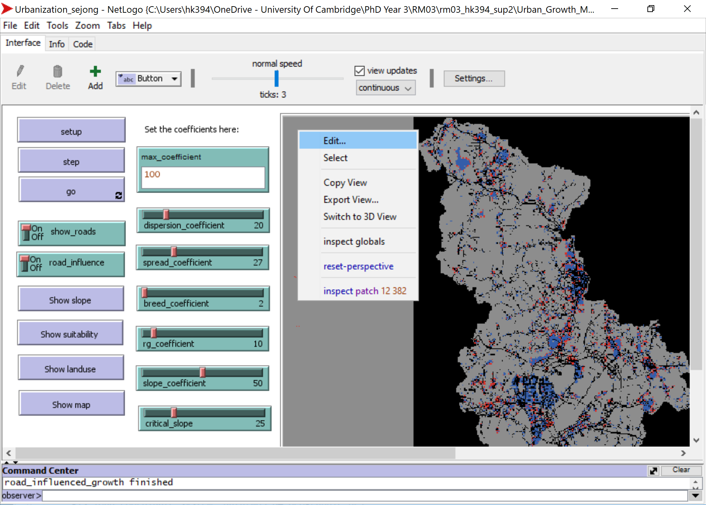
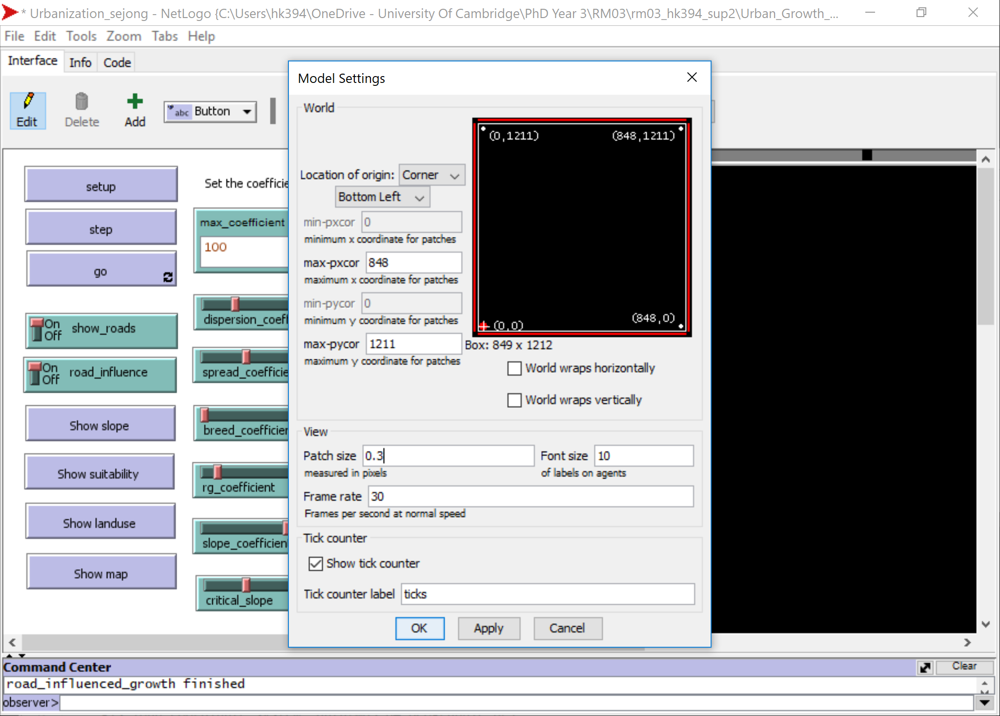

5. The Sejong masterplan sets that development is not possible on land with a slope greater than 20 degrees. 20 degrees slope equates to 36.4 percent slope. (Note: a simple degree to percent slope can be found online, for example [Calcunation.com](https://www.calcunation.com/calculator/degrees-to-percent.php){:target="_blank"}. Move the `critical_slope` bar to `36` and see what changes.
6. The best-fit of five coefficients can be calculated through calibration which requires `extensions [r]` and many more. For more information on these coefficients, you can look at [Project Gigapolis webpage](http://www.ncgia.ucsb.edu/projects/gig/About/gwCoef.htm){:target="_blank"}.
7. Right-click anywhere on the map and click `inspect patch` You will see the properties of the selected cell e.g. urban, road, slope, excluded...

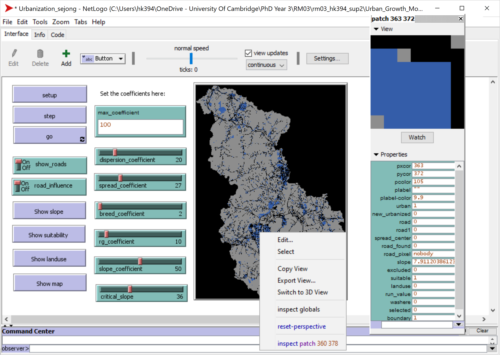

8. You can right-click on the `Percentage urbanized` chart and monitor and the `export_data` button along with the information and move this closer to the map.
9. Currently, `Percentage urbanized` is set without the boundary in consideration. Right-click on the `Percentage urbanized` monitor and change the reporter to `(count patches with [urban = 1 and boundary = 1]) / (count patches with [boundary = 1]) * 100`. Make necessary change to the chart too (e.g. change the reporter similarly to the monitor, and change the maximum values from 10 to 100).

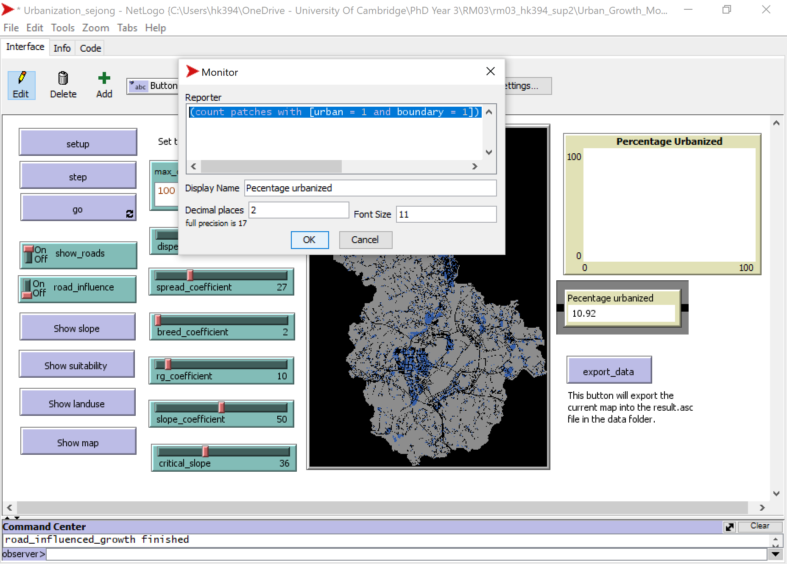

## Closing

10. In a short period of time, you have been introduced to the concept of NetLogo, how to load your own raster data into an existing model that uses the GIS extension, as well as making changes to the code. If you are more interested, there are many more resources available on the [NetLogo website](https://ccl.northwestern.edu/netlogo/){:target="_blank"}, for example, in `Help`, `Resources` and tabs under `Models` and `User Manuals`. Please feel free to reach out to Rain (hk394@cam.ac.uk) for any specific advise!
11. Also, there is an assignment [[Assignment]](supervision2-assignment.md) which will allow you to explore more of the codes on NetLogo using the Game of Life model. Thanks for your concentration!

### Teaching materials are prepared by Heeseo Rain Kwon (hk394@cam.ac.uk).
