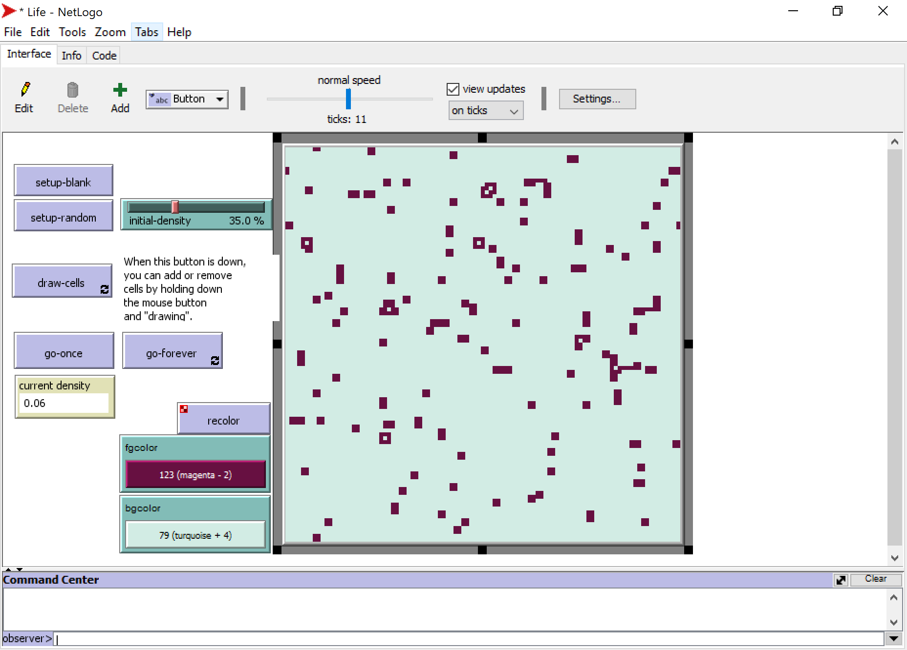
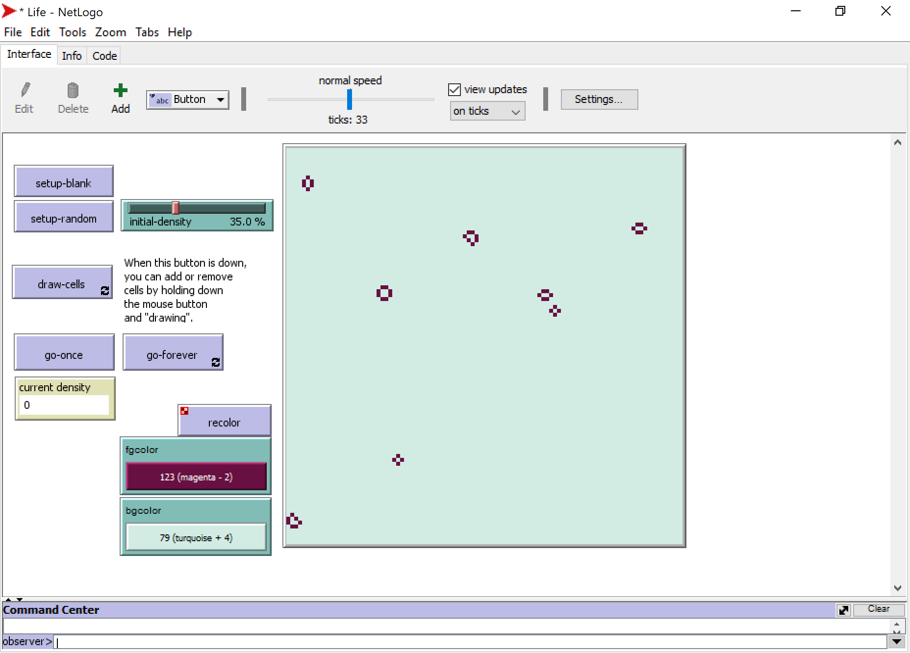

# Assignment for Supervision 2 - Answers

### Teaching materials are prepared by Heeseo Rain Kwon (hk394@cam.ac.uk).

#### Question 1. Click the `Info` tab below the `Menu bar`. Under `HOW IT WORKS`, you can find the rules of the game. Rules can be summarised as the four points below. 
1. If there is exactly 3 alive neighbors, the cell becomes alive. (birth)
2. If there are less than 2 alive neighbors, the cell dies. (under-population)
3. If there are more than 3 alive neighbors, the cell dies. (over-population)
4. If there are 2 alive neighbors, the cell remains in the state it is in. (sustainable life)
#### 1-1. Try writing these into NetLogo code using `if` (http://ccl.northwestern.edu/netlogo/docs/dict/if.html) statement, one line of code for the first three points (Note: You don't need to worry about the 4th point because it doesn't change the cell state). 
Model answer:  
1. `if live-neighbors = 3 [ cell-birth ]`
2. `if live-neighbors < 2 [ cell-death ]`
3. `if live-neighbors > 3 [ cell-death ]`

#### 1.2. Explain how these three lines of code can be shortened to line 39-42 written in the model.
- Model answer: `if live-neighbors < 2 [ cell-death ]` and `if live-neighbors > 3 [ cell-death ]` can be combined to `if live-neighbors != 2 [ cell-death ]` as `[ elsecommands ]` of the `ifelse` command if no `if live-neighbors = 3 [ cell-birth ]` reports true.


#### Question 2. In line 33, try changing `neighbors` to `neighbors4` and run the model. Observe and explain how this change affects the simulation. (Refer to `neighbors4`(http://ccl.northwestern.edu/netlogo/docs/dict/neighbors4.html).)
- Model answer: Changing from `neighbors` to `neighbors4` reduces the number of a cell's neighbours from 8 to 4. This makes it more difficult to have `cell-birth` because the chance of having 3 alive neighbors out of 4 is lower than out of 8. This makes the cells die out and at initial density of 35%, by about tick 11, the remaining alive cells do not change the state anymore. 



#### Question 3. Let's add one additional command to the model. Add the following lines below the `to cell-death` part. Explain this rule in your own words.

```
to zombie-birth 
  set living? true 
  ask neighbors [ cell-death ] 
  set pcolor green 
end
```

- Model answer: Begin a command procedure of `zombie-birth` and set these cells as living cells. Make these zombie cells kill their eight surrounding patches (neighbors) by making them run the [ cell-death ] command. Color these zombie cells green.

#### Question 4. Let's add a new rule for `zombie-birth`. Add the following lines below the `ask patches [ ifelse ]` part. This rule runs the same ifelse command on the 1,000 randomly chosen patches, this time for `zombie-birth`. (Note: `n-of`(http://ccl.northwestern.edu/netlogo/docs/dict/n-of.html)). Run the model and explain how this change affects the simulation.

```
ask n-of 1000 patches  
  [ ifelse live-neighbors = 3 
    [ zombie-birth ] 
    [if live-neighbors != 2
      [ cell-death ] ] ]
```

- Model answer: The green zombie cells kill the alive cells and by around tick 33, the remaining alive cells do not change the state anymore (survivors).



#### Question 5. In 500 words, explain how the concept of game of life can apply to planning-related studies. Suggested reading includes the following and you can also refer to other materials that you find. In-text citation is encouraged. 
- Dounas, T. et al. (2017) ‘Dense Urban Typologies and the Game of Life: Evolving Cellular Automata’, in Çağdaş, G. et al. (eds) Proceedings of the 17th International Conference on Computer Aided Architectural Design Futures, Istanbul Technical. Levent, Istanbul: Cenkler Matbaa, pp. 648–666. Available at: http://papers.cumincad.org/data/works/att/cf2017_648.pdf.
- Pinto, N. N. and Antunes, A. P. (2007) ‘Cellular automata and urban studies: a literature survey’, ACE: architecture, city and environment, 1(3), pp. 368–399. doi: 10.5821/ace.v1i3.2378. Available at: https://www.research.manchester.ac.uk/portal/files/22523283/POST-PEER-REVIEW-PUBLISHERS.PDF

- Model answer: We will show some good answers from students at the revision supervision and discuss.

### Teaching materials are prepared by Heeseo Rain Kwon (hk394@cam.ac.uk).
