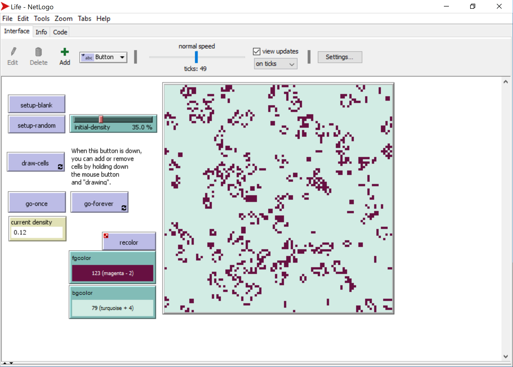
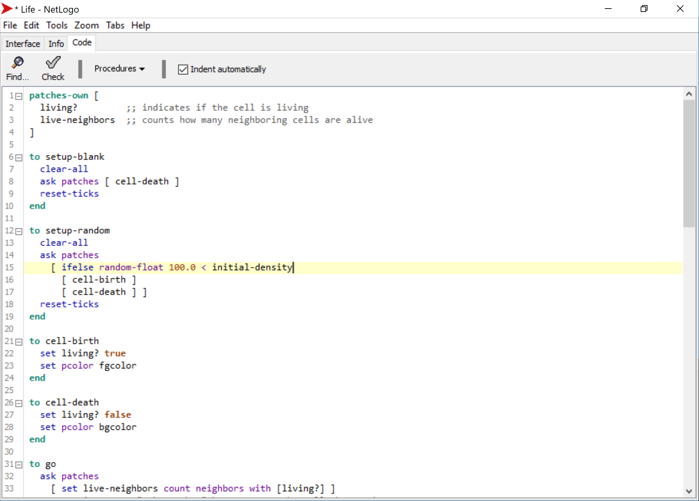
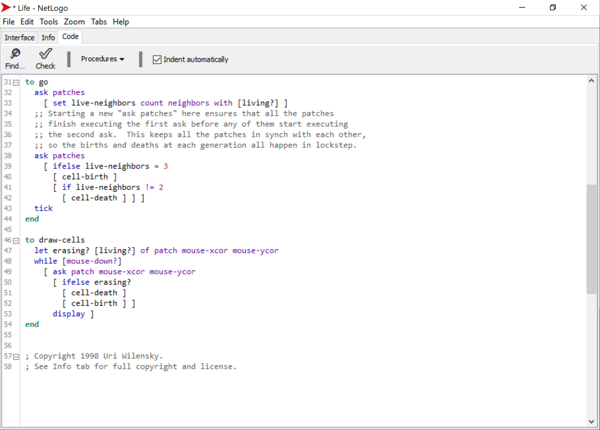
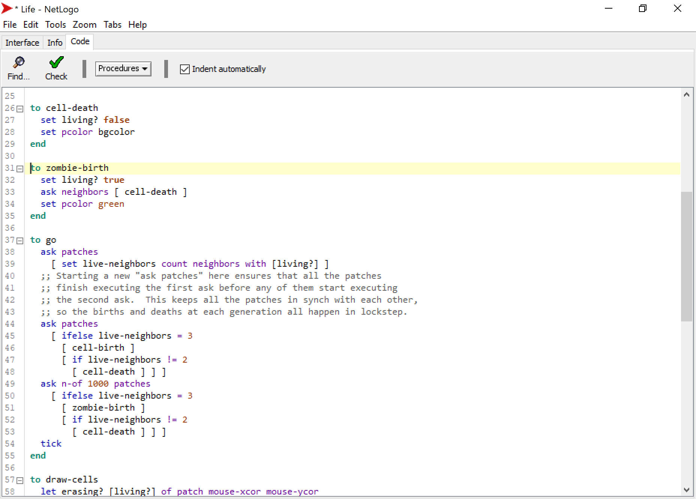
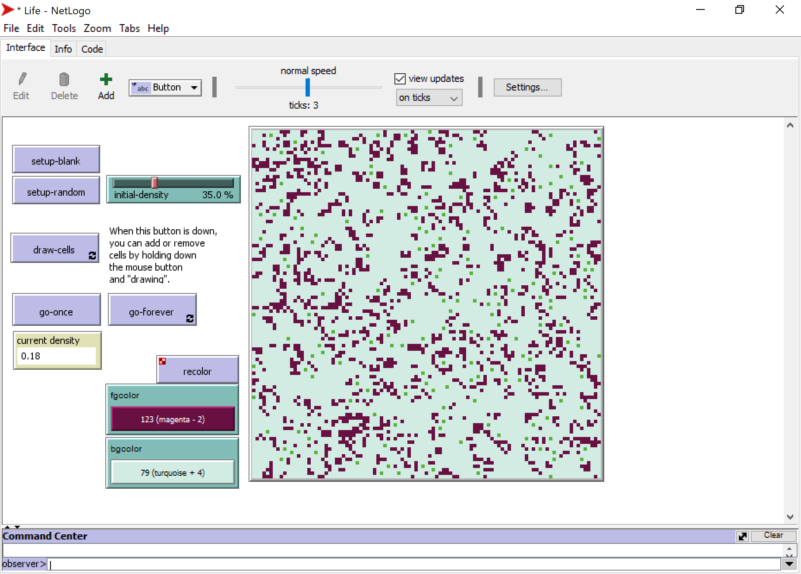

# Assignment for Supervision 2

### Teaching materials are prepared by Heeseo Rain Kwon (hk394@cam.ac.uk).

**Submission Dealine: 5 Mar(Thursday) 12:00pm, 2020**

## Instructions
1. Read through the instruction carefully. You may face problems if you overlook any of the steps.
2. Please write your answers in a new blank word document and submit on Moodle. You can add screen captures to aid your explanation if you wish.

Note: functions and filename are `highlighted` in this document.

## Assignment overview
In this assignment, you will familiarise yourself with changing the codes on NetLogo using the Game of Life model.

### Setup work environment
1. Open `NetLogo 6.1.1` (NOT `NetLogo 3D 6.1.1`).
2. Open `Life` from `Models Library` under `Sample Models` > `Computer Science` > `Cellular Automata`.
3. Game of Life is a simple cellular automata (CA) model where the state of the cells (patches) change according to behavioral rules. As the simulation runs, you can find recurring shapes like gliders and blinkers. Note: You can refer to `Conway's Game of Life`[(https://en.wikipedia.org/wiki/Conway%27s_Game_of_Life)](https://en.wikipedia.org/wiki/Conway%27s_Game_of_Life) for more detailed information.
4. Click `setup-random` > `go-forever` to start the simulation, and click `go-forever` again to stop the simulation.



### Understanding NetLogo codes

1. Let's check the `Code` tab. (Note: If you don't see line numbers, for Windows users, on the `Menu bar`, click `Tools` > `Preferences` and check `Show Line Numbers`. For Mac users, on the `Menu bar`, click `NetLogo` > `Preferences` and check `Show Line Numbers`.) 
2. In line 2-3, `living?` and `live-neighbors` are variables. In line 8, `ask patches [ cell-death ]` means to `ask`[(http://ccl.northwestern.edu/netlogo/docs/dict/ask.html)](http://ccl.northwestern.edu/netlogo/docs/dict/ask.html) patches to run the `[ cell-death ]` command. In line 26, `[ cell-death ]` command sets `living?` as false, and sets patch color as foreground color. `[ cell-birth ]` command does the opposite.
3. Line 14 means "ask patches to run the `ifelse`[(http://ccl.northwestern.edu/netlogo/docs/dict/ifelse.html)] (http://ccl.northwestern.edu/netlogo/docs/dict/ifelse.html) command. ifelse commands are very important in language-based rules. Line 15-17 means "if `random-float 100 < initial-density` reports true (in other words, "if a `random floating point number >= 0 but less than 100` is less than the `initial density (default=35)`"), run the `[ cell-birth ]` command, and otherwise, run the `[ cell-death ]` command. This part makes each cell to check the state of itself.
Note: You can refer to `NetLogo Dictionary` [(http://ccl.northwestern.edu/netlogo/docs/index2.html)](http://ccl.northwestern.edu/netlogo/docs/index2.html) when trying to understand the codes.



4. Line 33 means "set the variable `live-neighbors` to `count how many neighboring cells are alive`" and line 32 asks patches to run this command. This part makes each cell to check the state of its eight surrounding neighbors. Note: Refer to `neighbors`[(http://ccl.northwestern.edu/netlogo/docs/dict/neighbors.html)] (http://ccl.northwestern.edu/netlogo/docs/dict/neighbors.html).
5. Line 38 asks patches to run another ifelse command. 

#### Question 1. Click the `Info` tab below the `Menu bar`. Under `HOW IT WORKS`, you can find the rules of the game. Rules can be summarised as the four points below. 
1. If there is exactly 3 alive neighbors, the cell becomes alive. (birth)
2. If there are less than 2 alive neighbors, the cell dies. (under-population)
3. If there are more than 3 alive neighbors, the cell dies. (over-population)
4. If there are 2 alive neighbors, the cell remains in the state it is in. (sustainable life)
#### 1-1. Try writing these rules into NetLogo code using `if` [(http://ccl.northwestern.edu/netlogo/docs/dict/if.html)](http://ccl.northwestern.edu/netlogo/docs/dict/if.html) statement, one line of code for the first three points (Note: You don't need to worry about the 4th point because it doesn't change the cell state). 
#### 1.2. Explain how these three lines of code can be shorted to line 39-42 written in the model using the `ifelse` [(http://ccl.northwestern.edu/netlogo/docs/dict/ifelse.html)](http://ccl.northwestern.edu/netlogo/docs/dict/ifelse.html) command.




#### Question 2. In line 33, try changing `neighbors` to `neighbors4` and run the model. Observe and explain how this change affects the simulation. (Refer to `neighbors4`(http://ccl.northwestern.edu/netlogo/docs/dict/neighbors.html).)

#### Question 3. Let's add one additional command to the model. Add the following lines below the `to cell-death` part. This command makes this cell colored in green to kill the four surrounding patches. Explain this rule in your own words. (Note: In case you don't see green zombie cells appearing, you change the `neighbors4` back to `neighbors` as in the screenshot below and set the initial-density around 35% so that cells don't die out too quickly. Also, try pressing "go-once" several times rather than "go-forever".)
```
to zombie-birth
  set living? true
  ask neighbors [ cell-death ]
  set pcolor green
end
```


#### Question 4. Let's add a new rule for `zombie-birth`. Add the following lines below the `ask patches [ ifelse ]` part. This rule runs the same ifelse command on the 1,000 randomly chosen patches, this time for `zombie-birth`. (Note: `n-of`[(http://ccl.northwestern.edu/netlogo/docs/dict/n-of.html)](http://ccl.northwestern.edu/netlogo/docs/dict/n-of.html)). Run the model and explain how this change affects the simulation.
```
ask n-of 1000 patches
  [ ifelse live-neighbors = 3
    [ zombie-birth ]
    [if live-neighbors != 2
      [ cell-death ] ] ]
```         



#### Question 5. In 500 words, explain how the concept of game of life can apply to planning-related studies. Suggested reading includes the following and you can also refer to other materials that you find. In-text citation is encouraged. 
- Dounas, T. et al. (2017) ‘Dense Urban Typologies and the Game of Life: Evolving Cellular Automata’, in Çağdaş, G. et al. (eds) Proceedings of the 17th International Conference on Computer Aided Architectural Design Futures, Istanbul Technical. Levent, Istanbul: Cenkler Matbaa, pp. 648–666. Available at: http://papers.cumincad.org/data/works/att/cf2017_648.pdf.
- Pinto, N. N. and Antunes, A. P. (2007) ‘Cellular automata and urban studies: a literature survey’, ACE: architecture, city and environment, 1(3), pp. 368–399. doi: 10.5821/ace.v1i3.2378. Available at: https://www.research.manchester.ac.uk/portal/files/22523283/POST-PEER-REVIEW-PUBLISHERS.PDF


### Optional: Manually drawing cells
1. Open the original `Life` model from `Models Library` again. Click `setup-blank` and `draw-cells` button and manually attempt drawing shapes that are stable and do not change, or shapes that return to their initial state after a few ticks. (Note: You can test the patterns suggested here: https://en.wikipedia.org/wiki/Conway%27s_Game_of_Life.)

### Teaching materials are prepared by Heeseo Rain Kwon (hk394@cam.ac.uk).
